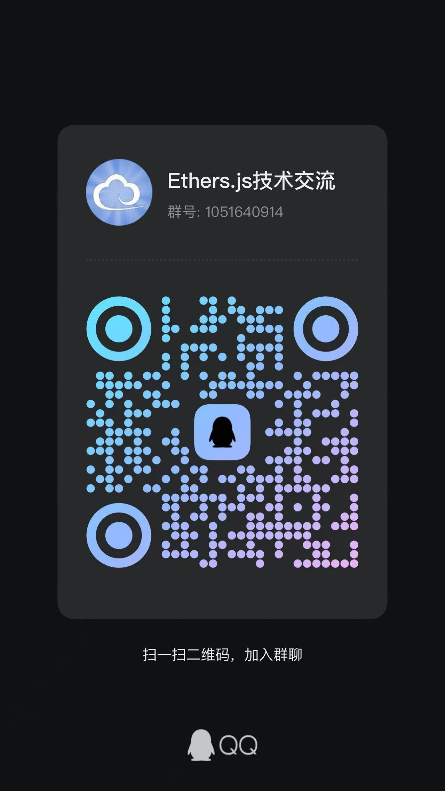

# Ethers.js v6 快速入门教程

## 概述

本教程是基于 `Ethers.js` v6 编写的，旨在帮助开发者快速掌握 `Ethers.js` 的使用方法。

你不一定要学习 `Ethers.js`，你也可以了解 `WEB3` 和 `如何与以太坊进行交互`。

[https://ethersjs.cn](https://ethersjs.cn) 在线阅读教程可以直接运行与`以太坊`进行交互，方便你 `零` 代码编写学习。

## 目录

### 快速入门

**第一章：** [基础概念了解 - Ethers.js](./docs/basic/index.md)

**第二章：** [准备工作 - 获取配置以方便后续快速学习](./docs/ready/index.md)

**第三章：** [Provider 类 - 连接到以太坊](./docs/provider/index.mdx)

**第四章：** [Contract 类 - 读取合约信息](./docs/contract/index.mdx)

**第五章：** [Utils - 常用工具合集](./docs/utils/index.md)

**第六章：** [钱包 - 创建随机钱包](./docs/wallet/createWallet.mdx)

**第七章：** [钱包 - 将钱包连接到网络](./docs/wallet/connectWalletProvider.mdx)

**第八章：** [转账 - 使用 ETH 进行转账](./docs/transaction/transactionEth.mdx)

**第九章：** [转账 - 使用 ERC-20 进行转账](./docs/transaction/transactionERC20.mdx)

**第十章：** [事件监听与过滤](./docs/events/index.mdx)

**第十一章：** [异常处理](./docs/exception/index.mdx)

**第十二章：** [连接 MetaMask 钱包](./docs/metaMask/index.mdx)

**第十三章：** [连接 MetaMask 钱包 - 获取 Signer](./docs/metaMask/index.mdx)

### 进阶

**第一章：** [Interface 类 - Interface 常用操作](./docs/advanced/interface/index.mdx)

**第二章：** [ENS - 注册属于自己的 ENS 域名](./docs/advanced/ens/index.md)

**第三章：** [流行钱包 - 判断安装与授权](./docs/advanced/multipleWallets/index.mdx)

**第四章：** [处理输入安全](./docs/advanced/security/index.mdx)

### 实战

**第一章：** [dApp - 编写简易 dApp 应用](./docs/combat/dApp/index.mdx)

### 其他

[水龙头](./docs/other/faucet/index.md)

[Gas 手续费](./docs/other/gas/index.md)

正在编写中...

## 在线阅读

[https://ethersjs.cn](https://ethersjs.cn)

[WEB3 相关资源可以从这里找到](https://nav3.cn/#/?id=25)

## 运行

```bash
$ git clone --depth=1 https://github.com/xjh22222228/ethers-tutorial.git
$ pnpm i
$ npm run start
```

<!-- ## 交流

 -->

## 支持

编写不易，如果觉得本教程对您有用，可以请作者喝杯咖啡。


## LICENSE

只要保持原作者署名，您可以自由地阅读、分享、修改。
