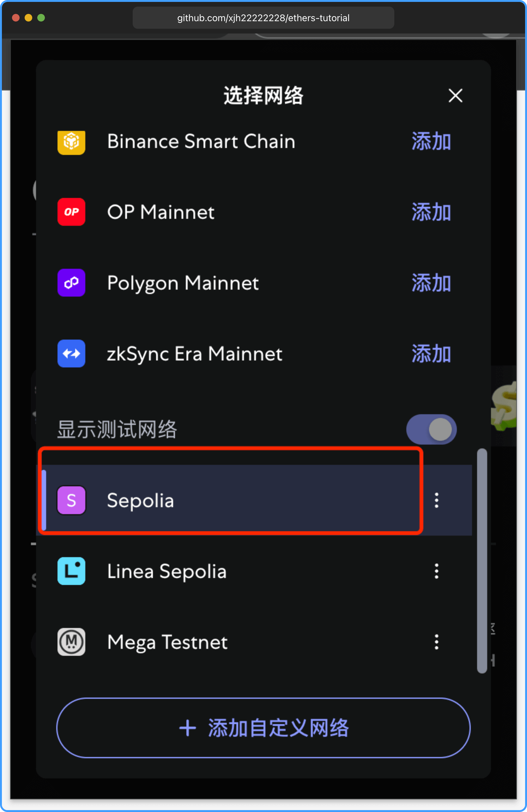
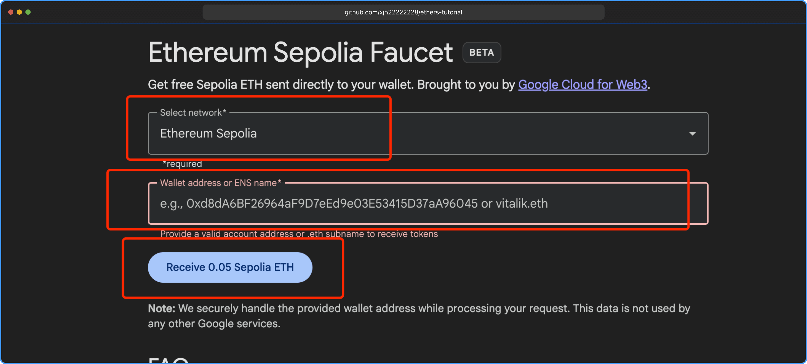
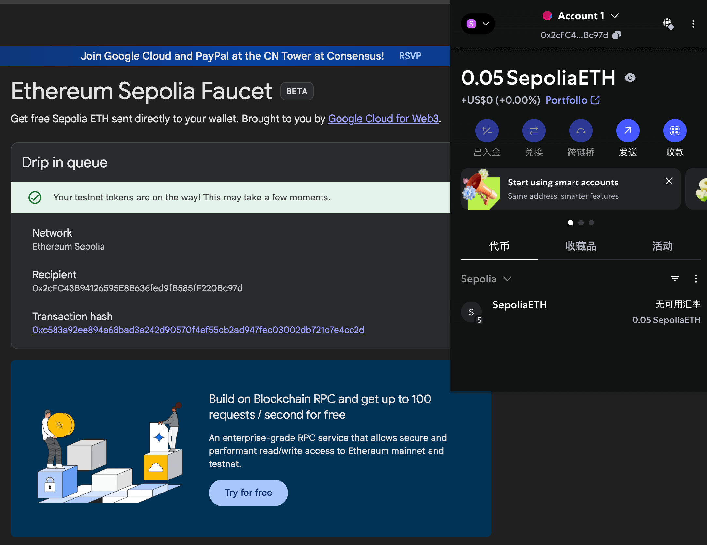
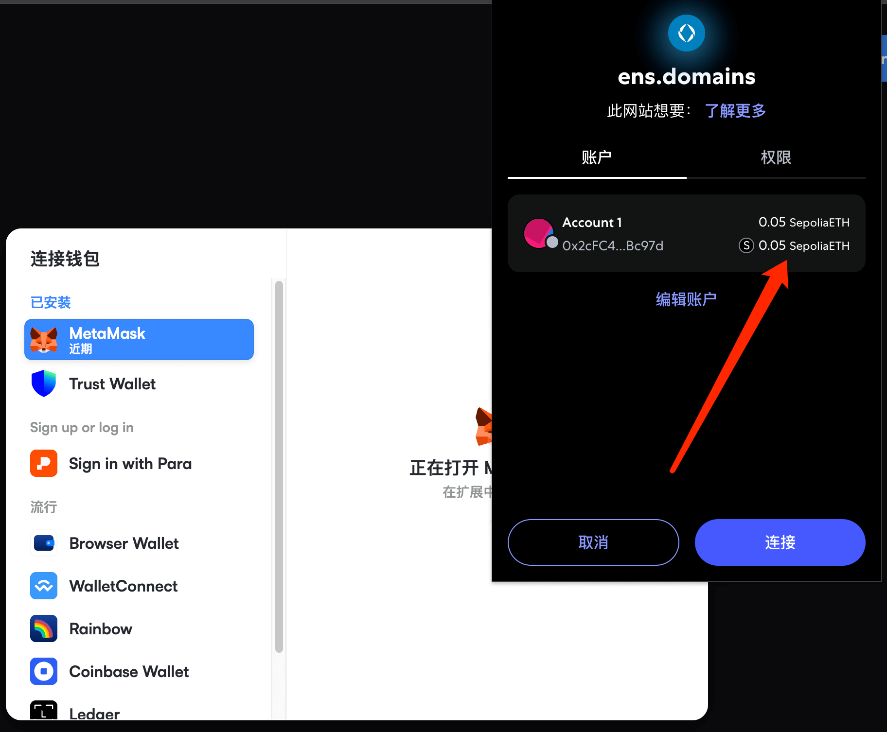
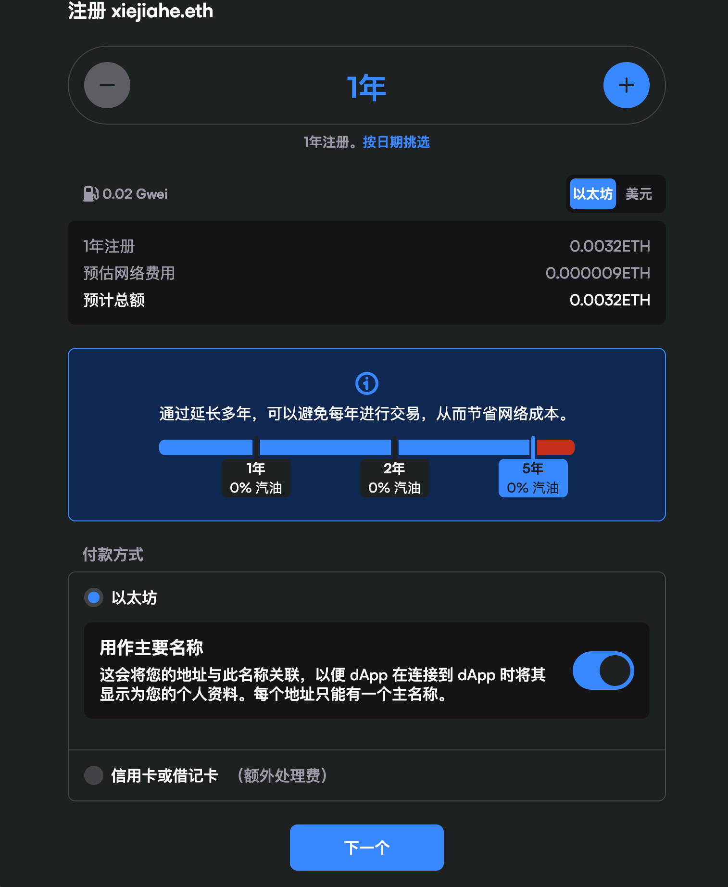
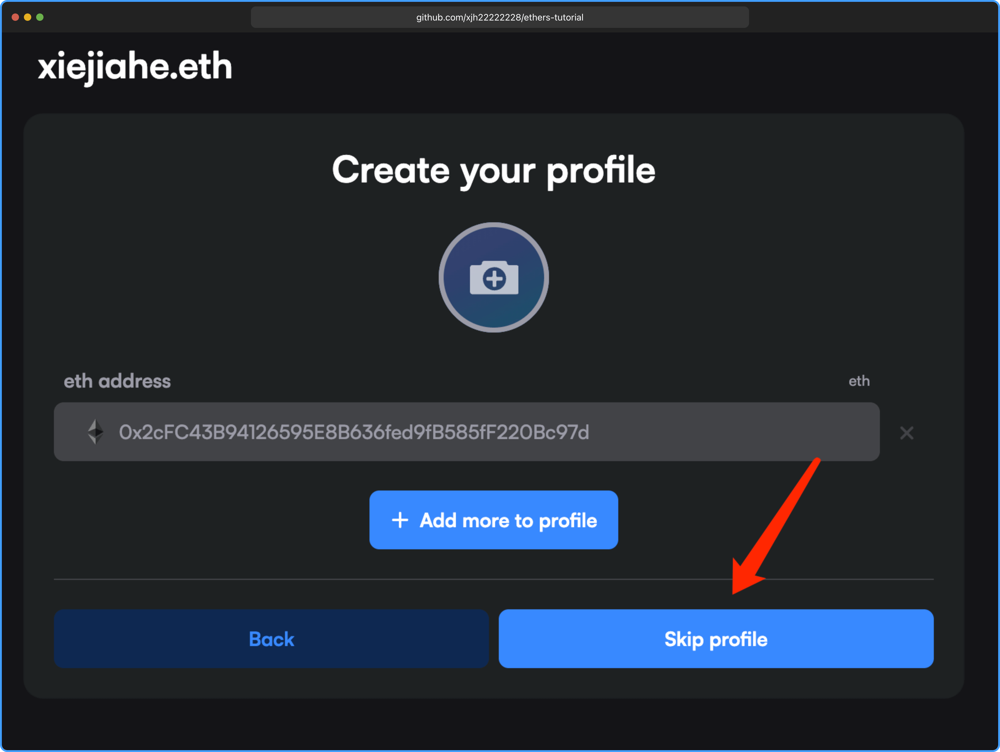
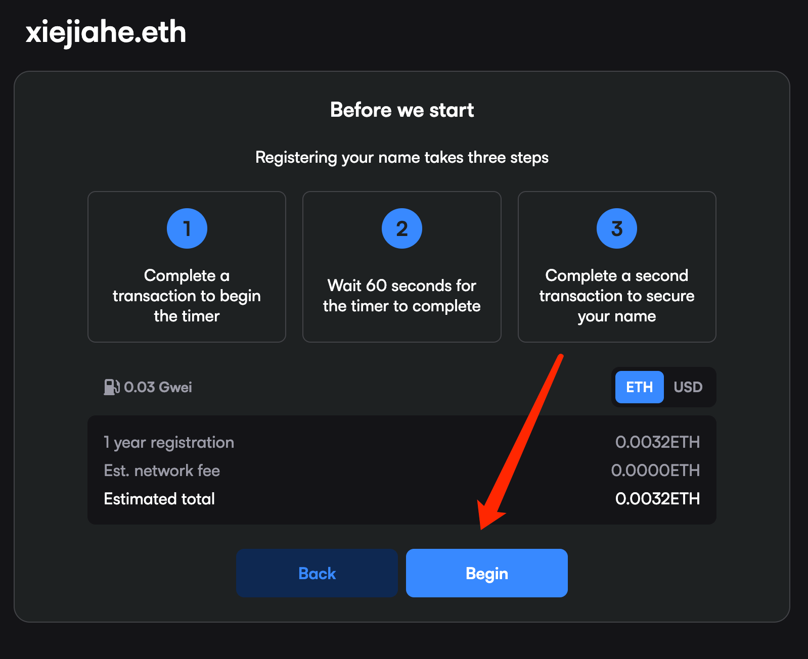
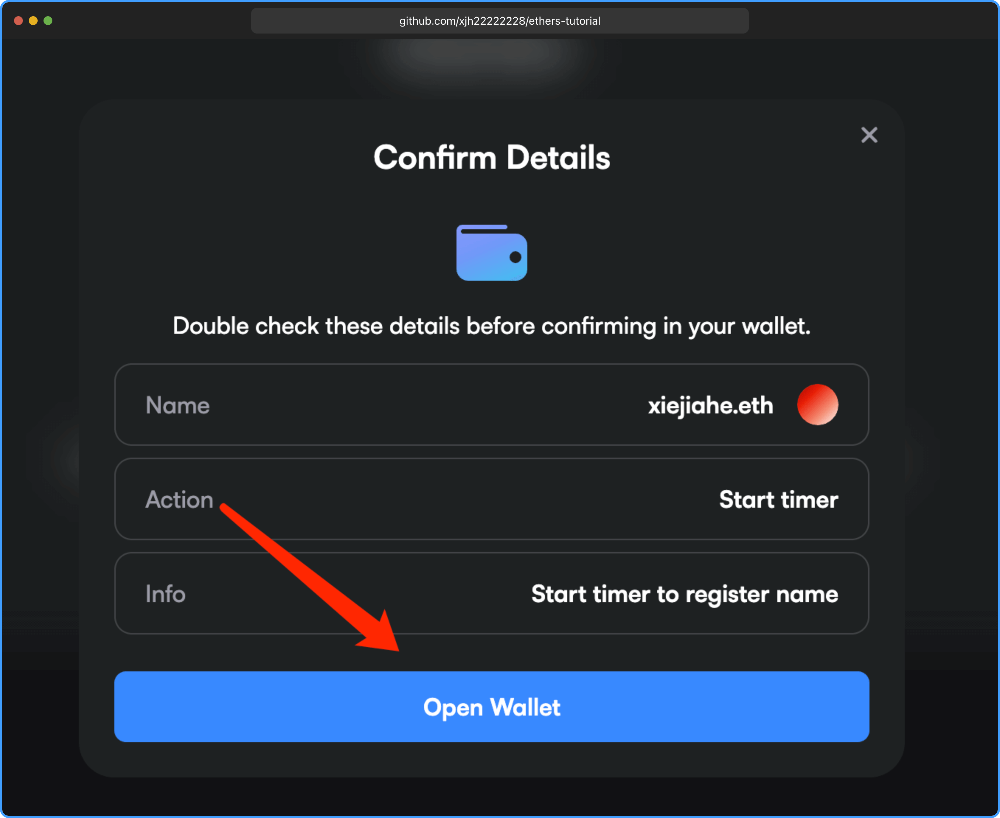
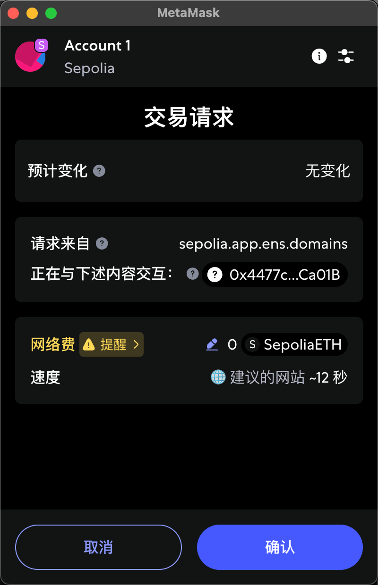
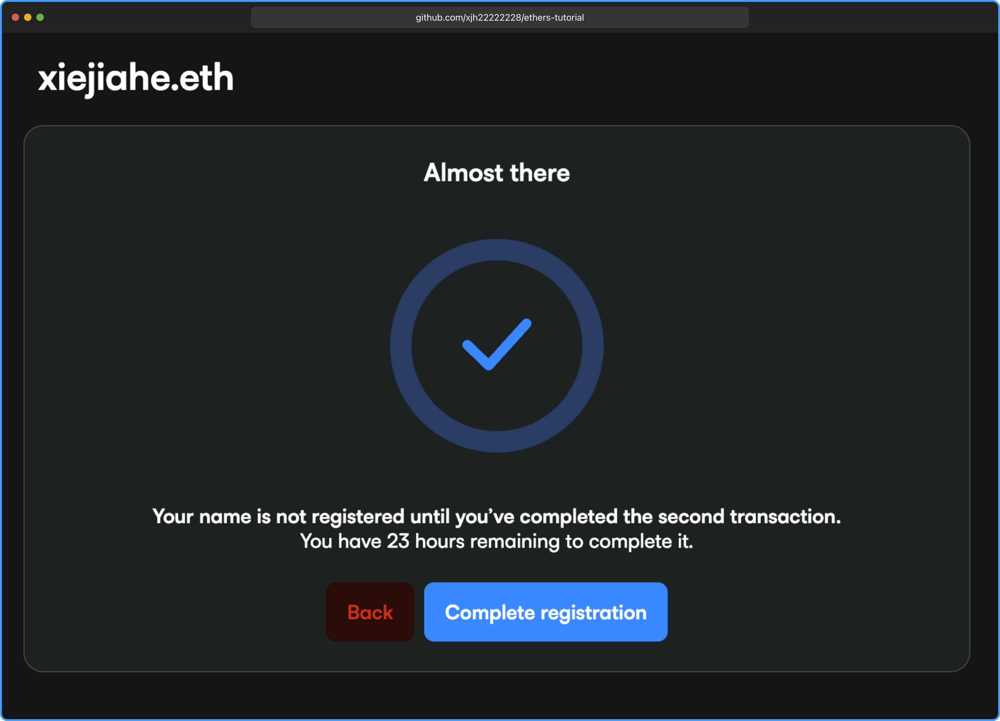

import Link from "@docusaurus/Link";

# ENS 域名

## 什么是 ENS 域名

ENS 域名（`Ethereum Name Service`）是以太坊区块链上的一种去中心化域名系统，旨在将复杂难记的以太坊地址`（如0x1234...）`替换为简单易读的名称`（例如vitalik.eth）`。它类似于传统互联网的`DNS`，但基于区块链技术，具有去中心化、不可篡改的特点。

#### 主要特点：

- **地址映射**：ENS 允许用户将以太坊地址、去中心化网站（如 IPFS 内容）或其他区块链资源绑定到一个可读的域名上。
- **去中心化**：ENS 运行在以太坊区块链上，由智能合约管理，无需中心化机构控制。
- **扩展性**：支持绑定多种数据，如钱包地址、电子邮件、社交媒体账户等。
- **顶级域名**：最常见的 ENS 域名以`“.eth”`结尾，但也支持其他定制顶级域名。

#### 用途：

- 简化交易：用 `vitalik.eth` 代替长地址，方便转账。
- 去中心化网站：通过`ENS`访问托管在`IPFS`等去中心化存储上的网站。
- 身份认证：作为去中心化身份的一部分，整合多种个人信息。

简单来说 `127.0.0.1` 域名就是 `localhost`， 所以 `ENS` 就是地址的别名

示例代码：

```js
import { ethers } from "ethers";

const provider = new ethers.JsonRpcProvider(
  "https://ethereum-sepolia-rpc.publicnode.com"
);
const balance = await provider.getBalance("vitalik.eth");
// 等价下面的地址
const balance2 = await provider.getBalance(
  "0xd8dA6BF26964aF9D7eEd9e03E53415D37aA96045"
);
```

## 注册 ENS

### 领取水龙头

- `ENS` 域名需要支付注册费用（基于以太坊 `Gas` 费）并定期续费。
- 在之前的所有示例教程我们都不是使用 `Sepolia` 测试网进行学习，免费注册 `ENS` 域名需要使用 `Sepolia` 测试网。
- `Sepolia` 测试网主要是以太坊提供的用来学习和测试使用。

在 `MetaMask` 钱包中点击左上角切换到 `Sepolia` 测试网，如果列表没有需要手动添加。



打开 [https://cloud.google.com/application/web3/faucet/ethereum/sepolia](https://cloud.google.com/application/web3/faucet/ethereum/sepolia) 这是 Google 提供的水龙头领取 `Sepolia` 测试网的 `ETH` , 可以领取 `0.05` `ETH`。

输入 `MetaMask` 中的钱包地址，地址在最顶部，点击领取。



领取后打开 `MetaMask` 钱包，点击 `Sepolia` 测试网，查看余额是否到账。



### 开始注册

打开 [https://sepolia.app.ens.domains](https://sepolia.app.ens.domains) `Sepolia` 测试网注册 `ENS`，只有这一个地方可以注册 `ENS`。

打开右上角 `Connect` 连接 `MetaMask` 钱包，并确认连接的是否是 `SepoliaETH`，如果不是请先切换为 `Sepolia` 网络。



搜索需要注册的 `ENS` 域名，例如 `xiejiahe`，显示可注册。


支付一年 `Gas` 费用



一直下一步，省略说明。











注册成功，你可以在这里查看我的 `ENS` [https://sepolia.app.ens.domains/xiejiahe.eth](https://sepolia.app.ens.domains/xiejiahe.eth)


### 使用 ENS 获取余额

校验测试申请的 `ENS` 是否可以获取余额。

必须要使用支持 `Sepolia` 的 `RPC` 节点。

`publicnode` 提供了一个公共的节点，由于是公共节点可能有一些不稳定的因素无法查询。

- [https://ethereum-sepolia-rpc.publicnode.com](https://ethereum-sepolia-rpc.publicnode.com)

如果公共节点无法查询使用 [https://www.infura.io](https://www.infura.io/zh) 注册并得到 `API Key`

- `https://sepolia.infura.io/v3/你的API_KEY`

下面代码使用刚刚申请的 `xiejiahe.eth` ENS 查询余额。

```js
import { ethers } from "ethers";

const provider = new ethers.JsonRpcProvider(
  "https://ethereum-sepolia-rpc.publicnode.com"
);

const balance = await provider.getBalance("xiejiahe.eth");

console.log("balance", balance.toString());
```

import ENS from "./ENS";

<ENS />

### 查询 ENS 地址

使用 `resolveName` 方法可以反向查询，具体看 <Link to="/docs/provider/#resolvename-查询-ens-地址">resolveName</Link>

```js
const address = await provider.resolveName("vitalik.eth");
// 0xd8dA6BF26964aF9D7eEd9e03E53415D37aA96045
```

## 总结

`ENS` 域名极大地简化了以太坊地址的使用体验，让用户可以像访问网站一样便捷地管理和转账资产。通过本教程，你学会了什么是 ENS、如何在 `Sepolia` 测试网上注册 `ENS` 域名，以及如何通过 `ethers.js` 查询 `ENS` 域名的余额和地址。`ENS` 不仅提升了区块链的可用性，也为去中心化身份和 `Web3` 应用提供了基础设施。建议大家多多实践，体验 `ENS` 带来的便利。

本章所有示例代码，均可在 [GitHub](https://github.com/xjh22222228/ethers-tutorial/blob/main/docs/advanced/ens/ENS.tsx) 中找到。
