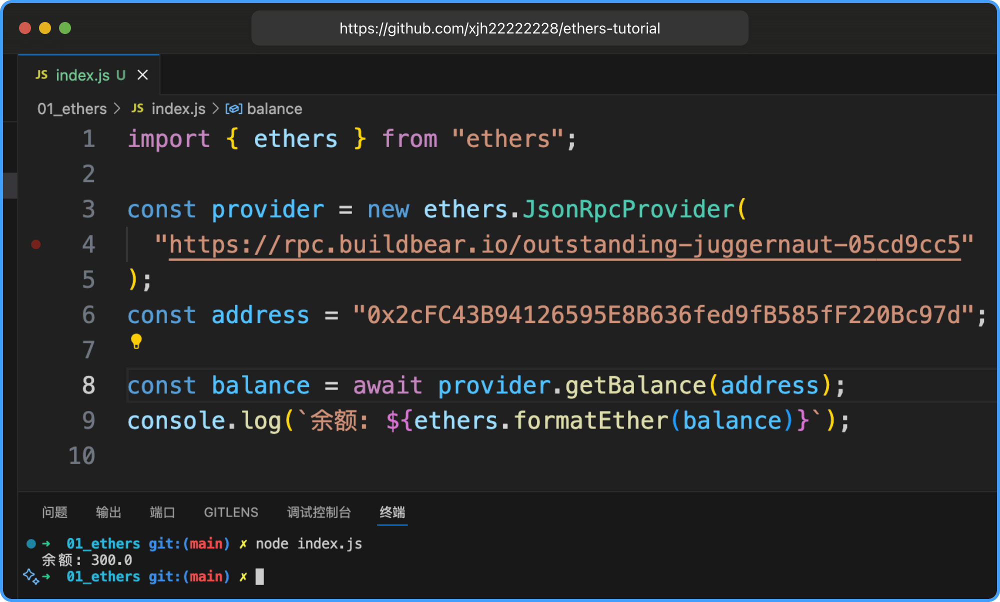

# Ethers.js

`Ethers.js` 是一个轻量级的 `JavaScript` 库，用于与以太坊区块链及其生态系统交互。它提供了简单易用的 `API`，方便开发者构建去中心化应用（`DApps`）、管理钱包、发送交易、与智能合约交互以及查询区块链数据。

### 主要功能

1. 钱包管理：创建、导入和管理以太坊钱包，支持私钥、助记词和 HD 钱包。
2. 智能合约交互：通过 `ABI（Application Binary Interface）`与以太坊智能合约进行交互，调用函数或发送交易。
3. 区块链交互：连接到以太坊节点（如 `Infura`、`Alchemy` 或本地节点），查询余额、交易状态、区块信息等。
4. 交易处理：构造、签名和发送以太坊交易，支持 `gas` 估算和动态调整。
5. 工具集：提供加密工具（如签名、哈希）、单位转换（如 `ETH` 和 `Wei`）以及地址验证等功能。

### 特点

- 轻量：相比 `Web3.js`，`Ethers.js` 更小巧，代码更简洁。
- 模块化：支持 `Tree-shaking`，适合现代前端开发。
- `TypeScript` 支持：提供强类型支持，开发体验更友好。
- 跨平台：适用于浏览器和 `Node.js` 环境。

### 使用场景

- 构建去中心化应用（`DApps`）
- 开发以太坊钱包或 `DeFi` 应用
- 与智能合约交互（如 `ERC-20、ERC-721` 代币）
- 执行区块链数据查询或交易自动化

### 示例代码

```js
import { ethers } from "ethers";

const provider = new ethers.JsonRpcProvider(
  "https://rpc.buildbear.io/outstanding-juggernaut-05cd9cc5"
);
const address = "0x2cFC43B94126595E8B636fed9fB585fF220Bc97d";

const balance = await provider.getBalance(address);
console.log(`余额: ${ethers.formatEther(balance)}`); // 余额: 300.0
```


