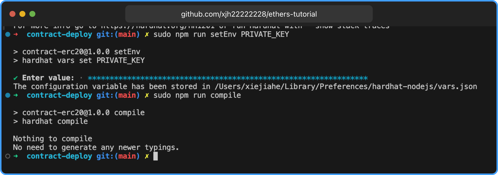
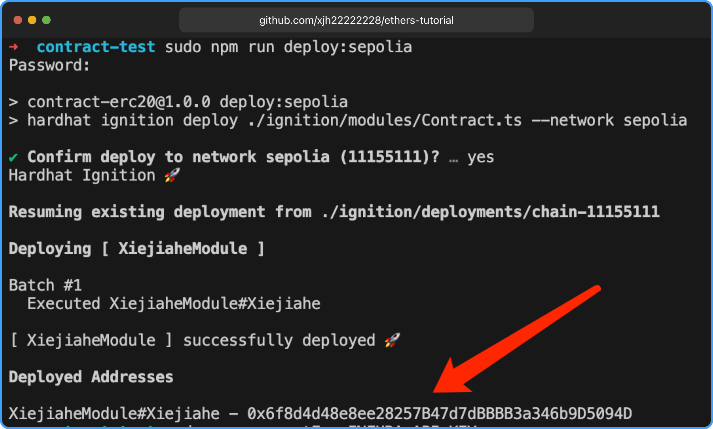
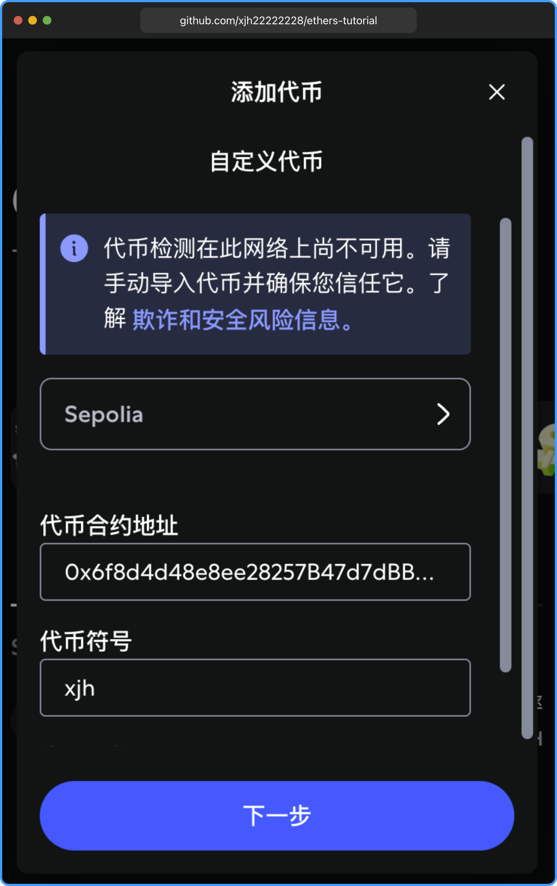
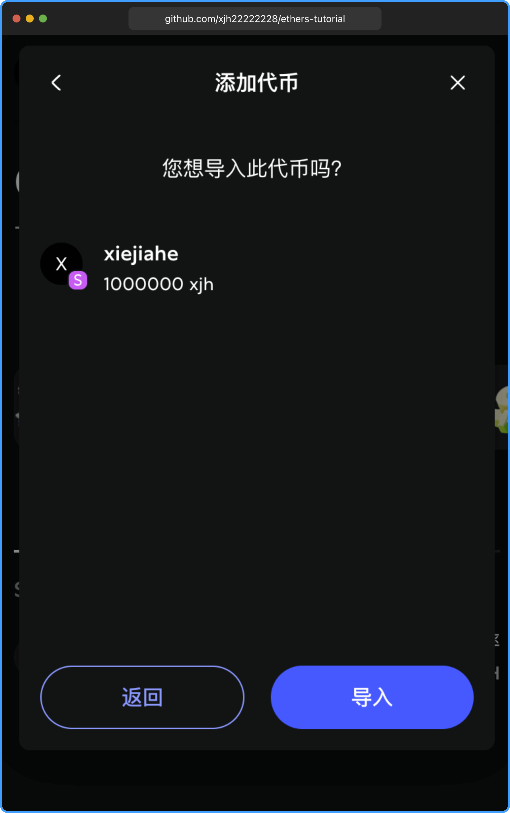

import Link from "@docusaurus/Link";

# 部署 ERC20 合约

开发合约需要使用 [solidity](https://docs.soliditylang.org/zh-cn) 语言开发，使用原生 solidity 开发会比较复杂，这里使用 [hardhat](https://hardhat.org/) 框架进行开发，hardhat 是一个基于 [ethers](https://docs.ethers.io/v5/) 的开发框架，使用 hardhat 可以快速开发合约，并且可以快速编译和部署合约。

本章不会介绍 `solidity` 的相关语法或信息，只介绍如何编译和部署合约到 `Sepolia` 测试网。

## 拉取合约代码

这里已经搭建好合约的开发环境，只需要修改部分配置就能实现自己的合约代币。

拉取 GitHub 上的代码：

```bash
$ git clone --depth=1 https://github.com/xjh22222228/ethers-tutorial.git
```

## 安装依赖包

```bash
$ pnpm i
```

## 设置环境变量

- `PRIVATE_KEY`：钱包账户密钥，用于往部署合约者发送代币和扣除部署合约 Gas 费用。
- `INFURA_API_KEY`：Infura API Key [没有需要先注册](https://www.infura.io/zh)

输入后回车，会要求输入密钥。

```bash
$ npm run setEnv PRIVATE_KEY
```

```bash
$ npm run setEnv INFURA_API_KEY
```

## 修改代币名称

修改 [packages/contract-deploy/contracts/Contract.sol](https://github.com/xjh22222228/ethers-tutorial/blob/main/packages/contract-deploy/contracts/Contract.sol)

xiejiahe 是代币名称，xjh 是代币符号， 修改为你的代币名称和符号。

```sol
ERC20("xiejiahe", "xjh")
```

## 编译合约

编译的结果和字节码 ABI 等信息会在 `artifacts/contracts/Contract.sol` 目录下。

```bash
$ npm run compile
```



## 部署合约

在部署之前请确保你的钱包地址有足够的 `Sepolia` 测试网 ETH 余额，如果没有先领取免费的 <Link to="/docs/other/faucet/">ETH</Link>

部署成功会会显示合约地址，这里的合约地址是 `0x6f8d4d48e8ee28257B47d7dBBBB3a346b9D5094D`

可以从 [etherscan](https://sepolia.etherscan.io/token/0x6f8d4d48e8ee28257B47d7dBBBB3a346b9D5094D) 找到部署合约信息。

```bash
$ npm run deploy:sepolia
```



## 将合约代币添加到钱包中

打开 `MetaMask` 钱包添加代币，注意要选择 `Sepolia` 网络。



合约代币会添加到你部署的钱包地址中，这里发行了 **100 万** `xjh` 代币。



这个时候你就拥有自己的代币了。

## 使用 Ethers 查询代币余额

import Contract from "./Contract.tsx";

<Contract />

## 总结

本章介绍了如何使用 `Hardhat` 框架快速开发、编译并部署一个 `ERC20` 代币合约到 `Sepolia` 测试网。配置环境变量、修改代币名称和符号、编译与部署合约，并将代币添加到钱包中。通过 `Ethers` 查询代币余额。通过本章内容，你可以轻松创建并管理属于自己的 `ERC20` 代币。

本章所有示例代码，均可在 [GitHub](https://github.com/xjh22222228/ethers-tutorial/blob/main/packages/contract-deploy) 中找到。
