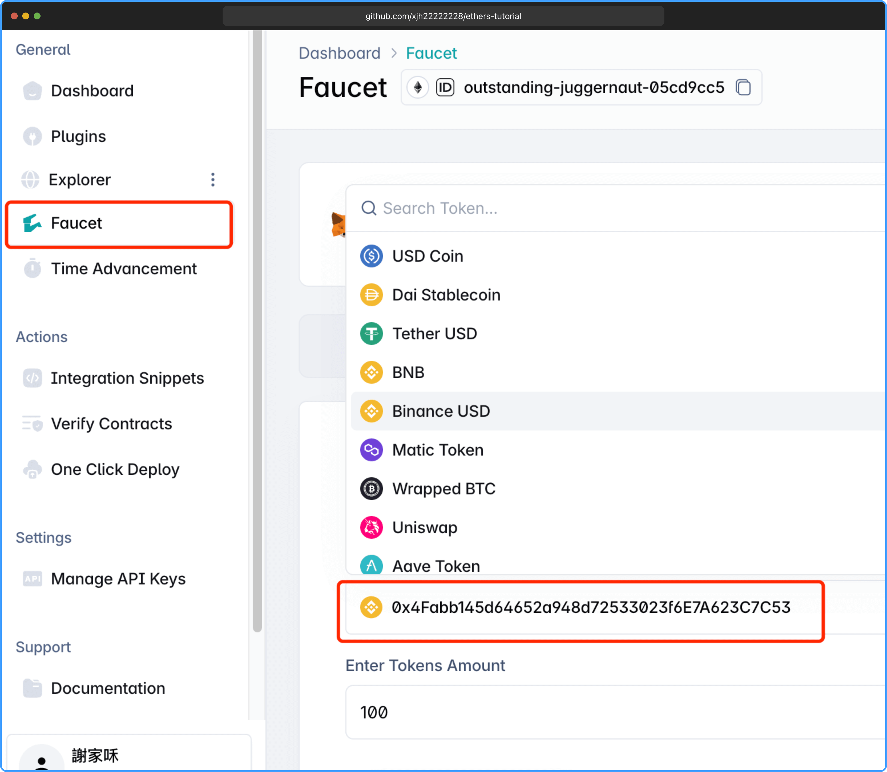

# Contract 合约类

## 什么是智能合约

智能合约是一段部署在区块链上的程序代码，它可以在满足一定条件时自动执行，不需要第三方介入。

**你可以把它想象成一种“自动售货机”：**

- 你投入某个条件（比如发送一定数量的以太币）；
- 智能合约就自动根据事先写好的代码执行，比如转账、发放代币、记录数据等；
- 没有人能更改执行逻辑，它是公开透明且不可篡改的。

## 什么是智能合约货币

**智能合约货币** 是指不是区块链原生代币（如 `ETH`、`BTC`），而是由智能合约发行和管理的代币。这类代币的行为（转账、授权、销毁等）完全由合约代码控制。

---

`ethers.Contract` 类是 `ethers.js` 提供的抽象层，用于与部署在以太坊区块链上的智能合约交互。它的主要作用包括：

- 封装智能合约的 ABI：通过智能合约的 ABI（Application Binary Interface，应用程序二进制接口），`ethers.Contract` 允许开发者以 JavaScript 对象的方式调用合约的函数，而无需手动构造底层的以太坊交易数据。
- 与区块链交互：通过与以太坊节点的连接（例如通过 Provider），Contract 类可以发送交易（写操作）或查询数据（读操作）。
- 事件监听：可以监听智能合约发出的事件（event），以便在特定事件发生时触发回调。
- 简化开发：开发者无需深入了解以太坊的底层协议细节，`ethers.Contract` 提供了高层次的接口来简化智能合约的调用和操作。

简单来说，`ethers.Contract` 是开发者与智能合约交互的桥梁，通过它可以轻松调用合约的函数、查询状态变量、发送交易或监听事件。

#### Contract 的构造函数

```js
new ethers.Contract(contractAddress, abi, providerOrSigner);
```

**参数说明：**

- `contractAddress`（字符串）：智能合约的部署地址（格式如 `0x...`）。
- `abi`（数组或对象）：智能合约的 ABI，描述了合约的接口（函数、事件等）。通常以 JSON 格式提供，可以从编译后的合约 artifacts 中获取。
- `providerOrSigner`（`Provider` 或 `Signer`）：
  - `Provider`：用于只读操作（如查询合约状态），通过 `ethers.JsonRpcProvider` 或其他提供者连接到以太坊节点。
  - `Signer`：用于签名交易（如调用修改状态的函数），通常通过 `ethers.Wallet` 或其他钱包（如 MetaMask）提供。

**返回值：** 一个 `ethers.Contract` 实例，代表指定的智能合约，允许调用其函数、查询状态或监听事件。

## 读取合约信息

读取合约关键点需要声明 `ABI` 接口，用于调用合约方法。

```js
const provider = new ethers.JsonRpcProvider(
  "https://rpc.buildbear.io/outstanding-juggernaut-05cd9cc5"
);
// 编写交互ABI，后面会介绍ABI是什么
const abi = [
  "function balanceOf(address owner) view returns (uint256)",
  "function decimals() view returns (uint8)",
  "function symbol() view returns (string)",
];

// 第一个参数是合约地址
const tokencontract = new ethers.Contract(
  "0x4Fabb145d64652a948d72533023f6E7A623C7C53",
  abi,
  provider
);

// 调用 ABI 编写的方法
// 查询代币余额，返回原始 wei
const balance = await tokencontract.balanceOf(
  // 钱包地址
  "0x2cfc43b94126595e8b636fed9fb585ff220bc97d"
);
// 查询代币符号
const symbol = await tokenContract.symbol();
// 查询代币小数位数
const decimals = await tokenContract.decimals();

console.log(balance); // 200000000000000000000
console.log(symbol); // BUSD
console.log(decimals); // 18
```

合约地址获取，打开 [buildbear](https://app.buildbear.io/)，选择代币会显示一个合约地址：



import Contract from "./Contract";

<Contract />

## ABI 是什么

ABI（Application Binary Interface，应用程序二进制接口）是以太坊智能合约开发中的一个关键概念，它定义了智能合约与外部世界（如前端应用、其他合约或工具）交互的接口。以下是对 ABI 的详细讲解，包括其定义、作用、结构、生成方式、使用场景以及相关示例，力求全面且易于理解。

#### ABI 的定义

ABI 是以太坊智能合约的标准化接口描述，通常以 JSON 格式表示。它定义了智能合约的函数、参数、返回值以及事件等信息，充当了合约与外部调用者之间的`“翻译器”`。简单来说，ABI 告诉调用者（如 ethers.js 或 web3.js）如何编码调用数据、如何解码返回数据，以及如何监听合约的事件。

- `类比`：你可以将 ABI 想象成一份“API 文档”，但它是为区块链上的智能合约设计的，描述了如何与合约交互。
- `核心作用`：ABI 确保外部程序能够以正确的方式与智能合约通信，而无需了解合约的底层字节码实现。

这里可以查看 ABI 方法文档 [https://eips.ethereum.org/EIPS/eip-20](https://eips.ethereum.org/EIPS/eip-20)

#### ABI 的作用

- 函数调用：
  - ABI 定义了合约的函数签名（包括函数名、参数类型、返回值类型），外部程序（如 DApp 或脚本）可以通过 ABI 构造调用数据，发送到区块链。
  - 例如，调用 transfer(address, uint256) 函数时，ABI 告诉调用者如何将参数编码为以太坊的交易数据。
- 事件监听：
  - ABI 描述了合约发出的事件（event），包括事件名称和参数，允许外部程序监听和解析事件数据。
  - 例如，监听 ERC20 合约的 Transfer(address, address, uint256) 事件。
- 数据编码与解码：
  - 以太坊的底层通信使用字节码，ABI 提供了编码（将参数转换为字节码）和解码（将字节码转换为人类可读数据）的标准方式。
  - 例如，将 uint256 类型的 100 编码为 32 字节的十六进制数据。
- 跨语言兼容性：
  - ABI 是一个标准化的接口，适用于任何支持以太坊的开发工具（如 ethers.js、web3.js、Solidity 等），确保不同语言和工具能够一致地与合约交互。
- 合约交互的简化：
  - 开发者无需手动处理底层的以太坊虚拟机（EVM）字节码，ABI 提供了高级接口，简化了开发流程。

#### ABI 的结构

ABI 是一个 JSON 数组，包含多个对象，每个对象描述合约的一个接口元素（函数、事件、构造函数等）。以下是 ABI 中常见的字段及其含义：

每个 ABI 对象的 `type` 字段指定了接口元素的类型，可能的值包括：

- `function`：普通函数（包括 `view`、`pure` 或修改状态的函数）。
- `constructor`：合约的构造函数（用于部署时初始化）。
- `event`：合约发出的事件，用于通知外部。
- `fallback`：回退函数（当调用不存在的函数时触发）。
- `receive`：接收以太币的函数（当合约收到 ETH 时触发）。

#### ABI 对象的主要字段

以 `function` 类型为例，一个典型的 ABI 对象包含以下字段：

- `type`：接口类型，例如 `"function"`。
- `name`：函数名称，例如 `"transfer"`。
- `inputs`：输入参数数组，每个参数包含：
  - `name`：参数名称（可选，用于文档）。
  - `type`：参数类型（如 `address`、`uint256`、`bytes`）。
  - `components`：如果参数是复杂类型（如 `struct`），会包含子字段描述。
- `outputs`：返回值数组（仅对 `view` 或 `pure` 函数有效），格式与 inputs 类似。
- `stateMutability`：函数的状态可变性，可能的值包括：
  - `pure`：不读取也不修改区块链状态。
  - `view`：只读取区块链状态，不修改。
  - `nonpayable`：可修改状态，但不接受 ETH。
  - `payable`：可修改状态且接受 ETH。

#### 示例 ABI

以下是一个简单的 ERC20 代币合约的 ABI 片段：

```json
[
  {
    "type": "function",
    "name": "transfer",
    "inputs": [
      { "name": "to", "type": "address" },
      { "name": "amount", "type": "uint256" }
    ],
    "outputs": [{ "name": "", "type": "bool" }],
    "stateMutability": "nonpayable"
  },
  {
    "type": "function",
    "name": "balanceOf",
    "inputs": [{ "name": "account", "type": "address" }],
    "outputs": [{ "name": "", "type": "uint256" }],
    "stateMutability": "view"
  },
  {
    "type": "event",
    "name": "Transfer",
    "inputs": [
      { "name": "from", "type": "address", "indexed": true },
      { "name": "to", "type": "address", "indexed": true },
      { "name": "value", "type": "uint256", "indexed": false }
    ],
    "anonymous": false
  }
]
```

- 如果只调用部分函数，可以只在 [ABI 文档](https://eips.ethereum.org/EIPS/eip-20) 中包含相关函数，减少 JSON 大小。
- 示例：仅包含 `balanceOf` 和 `transfer` 的 ABI：

```js
const abi = [
  "function balanceOf(address) view returns (uint256)",
  "function transfer(address, uint256) returns (bool)",
];

await contract.balanceOf("0x...");
```

## 总结

本文介绍了 `ethers.js` 中 `Contract` 类的基本用法，详细讲解了 `ABI` 的概念、结构和作用，并通过示例说明了如何与智能合约进行交互。掌握 ABI 的结构和精简方法，有助于高效、安全地调用合约函数和监听事件。通过合理使用 `ethers.Contract`，开发者可以方便地读取合约信息、发送交易和处理事件，大大简化了以太坊 DApp 的开发流程。

本章所有示例代码，均可在 [GitHub](https://github.com/xjh22222228/ethers-tutorial/blob/main/docs/contract/Contract.tsx) 中找到。
