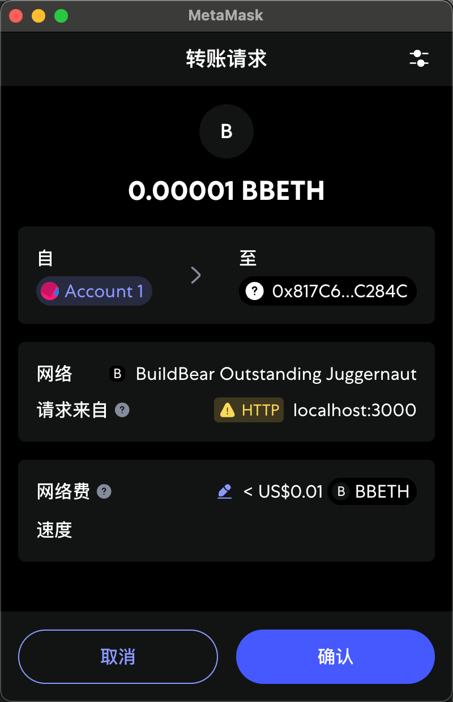

# 获取 Signer

## 什么是 Signer

在 `ethers.js` 中，`Signer` 是一个抽象类，代表一个可以签署以太坊交易或消息的实体。`Signer` 通常与以太坊账户（即私钥或钱包）相关联，能够：

- 签署交易（例如转账、调用智能合约）。
- 签署消息（例如用于验证身份的签名）。
- 查询与账户相关的信息（例如地址、余额等）。

下面的代码通过浏览器钱包 `MataMask` 授权并获取 `Signer` 对象。

```js
if (typeof window.ethereum !== "undefined") {
  const provider = new ethers.BrowserProvider(window.ethereum);

  const accounts = await window.ethereum.request({
    method: "eth_requestAccounts",
  });

  // 获取 signer
  const signer = await provider.getSigner();

  return;
}
```

#### 什么是 provider.getSigner()

`provider.getSigner()` 是 `Provider` 对象的一个方法，用于从当前的 `Provider` 实例中获取一个 Signer `实例。Provider` 是 `ethers.js` 中用于与以太坊区块链交互的对象，负责发送查询（如获取余额、读取合约状态）或广播交易。

## 通过 Signer 获取账户信息

`getSigner(address?: number | string): Promise<JsonRpcSigner>`

- `address` 可选参数，指定要获取信息的账户地址或者第几个账户，从`0`开始。如果不提供，则返回当前连接的默认账户。
- 返回一个 `JsonRpcSigner` 实例，该实例可用于执行签名操作。

示例

```js
// 默认授权账户
const signer = await provider.getSigner();

// 根据地址选择账户
const signer = await provider.getSigner(
  "0x2cFC43B94126595E8B636fed9fB585fF220Bc97d"
);

// 如果你有多个账户，可以输入数字选择第几个账户，从 0 开始
const signer = await provider.getSigner(0);
```

### 查询信息

通过 `Signer` 可以查询账户的信息，例如：

```js
import { ethers } from "ethers";

if (typeof window.ethereum !== "undefined") {
  const provider = new ethers.BrowserProvider(window.ethereum);

  await window.ethereum.request({
    method: "eth_requestAccounts",
  });

  // 获取 signer
  const signer = await provider.getSigner(address);
  // 通过signer获取地址和交易计数
  const addr = await signer.getAddress();
  const nonce = await signer.getNonce();
  console.log(addr, nonce);
}
```

import GetSigner from "./GetSigner";

<GetSigner />

## 通过 Signer 签名进行转账

以下是简单的转账，通过调用 `signer.sendTransaction` 方法发送交易。

```js
import { ethers } from "ethers";

if (typeof window.ethereum !== "undefined") {
  const provider = new ethers.BrowserProvider(window.ethereum);

  // 请求授权
  await window.ethereum.request({
    method: "eth_requestAccounts",
  });

  // 获取 signer
  const signer = await provider.getSigner();

  const tx = await signer.sendTransaction({
    // 转账地址
    to: "0x817c6ef5f2ef3cc56ce87942bf7ed74138ec284c",

    // 转账数量，解析成 wei 单位
    value: ethers.parseEther("0.0001"),
  });
  console.log(`交易已发送: ${tx.hash}`);

  // 等待交易确认
  await tx.wait();
  console.log(`交易已确认`);
}
```

**发起交易后会弹出授权确认交易：** 请先选择对应的网络确保有足够的余额

如果你使用的 `Buildbear` 水龙头请选择 `BuildBear Outstanding Juggernaut` 网络，否则选择 `Sepolia` 网络



import SignerTransaction from "./SignerTransaction";

<SignerTransaction />

## 总结

本章介绍了如何通过 `ethers.js` 与 `MetaMask` 集成，获取 `Signer` 实例，并利用 `Signer` 查询账户信息及发起转账操作。通过实际代码示例，你可以学会：

- 使用 `provider.getSigner()` 获取签名者对象；
- 查询账户地址、nonce 等基本信息；
- 使用 `signer.sendTransaction` 方法进行以太坊转账；
- 理解 `Signer` 在以太坊 `DApp` 开发中的核心作用。

本章所有示例代码，均可在 [GitHub](https://github.com/xjh22222228/ethers-tutorial/tree/main/docs/metaMask/getSigner) 中找到。
