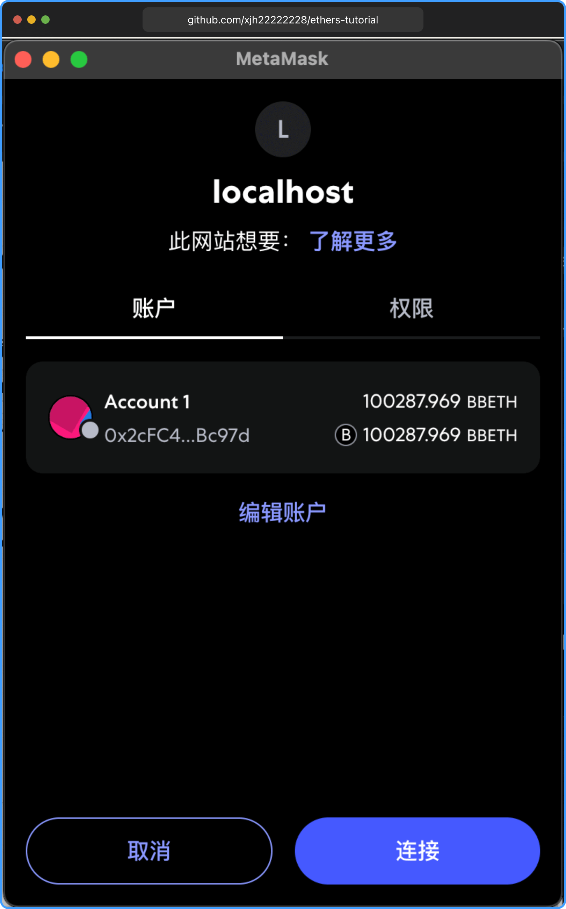

# 连接 MateMask 钱包

未安装 [MateMask](https://chromewebstore.google.com/detail/metamask/nkbihfbeogaeaoehlefnkodbefgpgknn?utm_source=ext_app_menu) 请先安装。

## 检测 MetaMask 是否安装

判断钱包是否安装很简单，只要判断 `window.ethereum` 是否存在，存在则表示已安装。

```js
if (typeof window.ethereum !== "undefined") {
  console.log("MetaMask 已安装!");
} else {
  console.log("请安装 MetaMask");
}
```

import CheckMateMask from "./components/CheckMateMask";

<CheckMateMask />

### 什么是 window.ethereum

`window.ethereum` 是一个全局 `JavaScript` 对象，通常由以太坊钱包扩展（如 `MetaMask`）在页面加载时注入到浏览器的 window 对象中。它是基于 `EIP-1193`（以太坊 `JavaScript` 提供者 API 规范）实现的，充当了 `Web3` 应用与以太坊区块链之间的桥梁。

- 作用：通过 `window.ethereum`，DApp（去中心化应用）可以：
  - 请求用户连接钱包以获取账户地址。
  - 与以太坊区块链交互（如发送交易、调用智能合约）。
  - 监听链上事件或钱包状态变化（如账户切换、网络切换）。
  - 请求用户签名消息或交易。
- 注入时机：当用户安装并启用了支持以太坊的浏览器扩展（如 MetaMask）时，扩展会在页面加载时将 `window.ethereum` 对象注入到 `window` 中。开发者可以通过检查 `window.ethereum` 是否存在来判断用户是否安装了兼容的钱包。

## 连接钱包（用户授权）

`ethers` 提供了 `BrowserProvider` 类来连接钱包，使用 `BrowserProvider` 可以通过 `window.ethereum` 来连接钱包。

使用 `send` 方法发送指令 `eth_requestAccounts` 来请求用户授权。

`async send(method: string, params: Array<any> | Record<string, any>): Promise<any>`

- `method`：要发送的方法名称，如 `eth_requestAccounts`。
- `params`：方法的参数，必须传入 `[]` 里面是参数。
- 返回值：返回一个 `Promise`，解析为方法的返回值。

```js
import { ethers } from "ethers";

if (typeof window.ethereum !== "undefined") {
  try {
    const provider = new ethers.BrowserProvider(window.ethereum);
    const accounts = await provider.send("eth_requestAccounts", []);
    console.log("accounts", accounts);

    // ['0x2cfc43b94126595e8b636fed9fb585ff220bc97d'] // 返回账号地址
  } catch (error: any) {
    console.log("用户拒绝授权", error.message)
  }
} else {
  console.log("请安装 MetaMask");
}
```

import ConnectMataMask from "./components/ConnectMataMask";

<ConnectMataMask />

点击后会弹出授权弹窗：



### send 指令

在 `ethers.js` 里，`provider.send(method, params)` 这个方法底层调用的是 以太坊 `JSON-RPC` API。也就是说，所有 `JSON-RPC` 方法（如 `eth_getBalance`, `eth_blockNumber`, `eth_requestAccounts` 等）都可以通过 send() 使用。

```js
await provider.send("eth_requestAccounts", []);
```

上面的代码本质是一个 JSON-RPC 请求

```json
{
  "method": "eth_requestAccounts",
  "params": []
}
```

**指令列表：**

- `eth_accounts`：获取当前已授权的地址（不弹窗）
- `eth_requestAccounts`：请求授权连接钱包（会弹窗）
- `eth_chainId`：获取当前网络的 Chain ID
- `eth_getBalance`：获取地址的 ETH 余额
- `eth_getTransactionCount`：获取地址的 nonce（交易计数）
- `eth_sendTransaction`：发起交易（MetaMask 会弹窗确认）
- `eth_call`：调用合约方法（不会上链）
- `eth_estimateGas`：估算交易 gas 用量
- `eth_blockNumber`：获取当前区块高度
- `eth_getBlockByNumber`： 获取某个区块的详细信息
- `eth_getTransactionReceipt`：获取交易的回执
- `eth_sign`：钱包对一段消息签名
- `personal_sign`：类似 `eth_sign`，更常用于 `Web3 DApp` 登录
- `wallet_switchEthereumChain`：请求用户切换网络（如从 `Goerli` 切换到 `Mainnet`）
- `wallet_addEthereumChain`：请求添加一个新的自定义网络（如 `Arbitrum`）

#### 获取余额示例：

```js
import { ethers } from "ethers";

const provider = new ethers.BrowserProvider(window.ethereum);
const accounts = await provider.send("eth_getBalance", [
  "你的地址", // 地址
  "latest", // 区块号，可选：'latest' | 'pending' | 'earliest' | 'finalized' | 'safe'
]);
```

详细参数和指令参考 [ethereum 官方文档](https://ethereum.org/zh/developers/docs/apis/json-rpc/#eth_getbalance) 、 [MetaMask API 文档](https://docs.metamask.io/wallet/reference/json-rpc-methods/)

## 监听用户账户变化

常见的监听场景包括：

- 检测用户是否切换了账户。
- 检测用户是否切换了网络（如从主网切换到测试网）。
- 检测钱包的连接状态变化。

```js
import { ethers } from "ethers";

const provider = new ethers.BrowserProvider(window.ethereum);
const accounts = await provider.send("eth_requestAccounts", []);

window.ethereum.on("accountsChanged", (accounts) => {
  notification.success({
    message: `切换账户: ${JSON.stringify(accounts || [])}`,
  });
});

window.ethereum.on("chainChanged", (chainId) => {
  notification.success({ message: `切换网络: ${chainId}` });
});
```

**常见事件：**

`window.ethereum` 提供了一些标准事件，用于监听钱包或区块链状态的变化。以下是主要事件及其含义：

- `accountsChanged`：用户切换了账户（或登出钱包）
- `chainChanged`：用户切换了网络
- `connect`：钱包连接成功（首次连接或页面刷新后自动恢复）
- `disconnect`：钱包断开连接（如 MetaMask 被锁定、账户被删除）
- `message`：主要用于底层订阅推送（如日志、价格预警等）如果你不是做低层协议交互，几乎不会用到。

import OnAccount from "./components/OnAccount";

<OnAccount />

## 总结

本节介绍了如何判断 `MetaMask` 是否安装、如何通过 `ethers.js` 的 `BrowserProvider` 连接钱包、请求用户授权，以及如何使用 `provider.send` 方法调用各种以太坊 `JSON-RPC` 指令（如获取账户、余额等）。掌握这些基础操作后，你可以在 `DApp` 中实现与用户钱包的交互，获取链上数据或发起交易。更多高级用法可参考官方文档，结合实际需求灵活运用。

本章所有示例代码，均可在 [GitHub](https://github.com/xjh22222228/ethers-tutorial/tree/main/docs/metaMask/components) 中找到。
