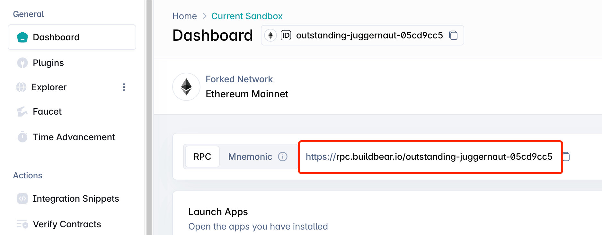
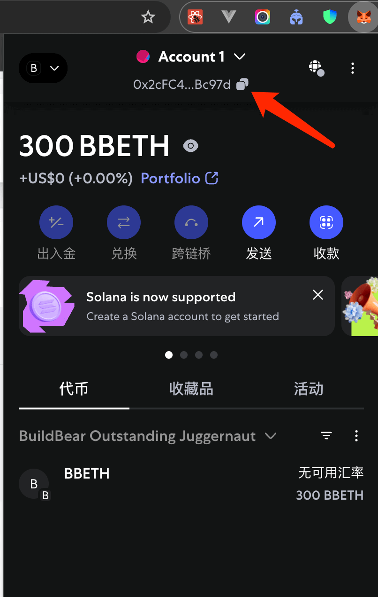

# Provider（连接到以太坊）

`Provider` 是与以太坊网络交互的接口，用于读取链上数据。

`ethers.js` 提供了十几种 `Provider` 最常用的是 `JsonRpcProvider`。

## 什么是 JsonRpcProvider

`JsonRpcProvider` 是 `ethers.js` 提供的一个类，用于通过 JSON-RPC 协议与以太坊节点通信。JSON-RPC 是一种轻量级的远程过程调用协议，广泛用于以太坊生态系统中，允许客户端（您的代码）向区块链节点发送请求（如查询余额、调用合约、发送交易等）。

与 `getDefaultProvider` 不同，`JsonRpcProvider` 要求开发者显式指定 RPC 端点的 URL，从而提供更高的控制权和灵活性。

## 连接

使用 [buildbear](https://app.buildbear.io/) 提供的测试网 RPC 节点。

```js
import { ethers } from "ethers";

const provider = new ethers.JsonRpcProvider("提供商的RPC测试节点");
```



# 读取链上数据

## getBalance 获取余额

返回最原始余额 `wei` 单位 ETH 余额，`Bigint` 类型。

传入 `address` 地址参数，`address` 在 `MetaMask` 钱包中最顶部 `0x...`。

```js
const balance = await provider.getBalance(
  "0x2cFC43B94126595E8B636fed9fB585fF220Bc97d"
);
console.log(balance.toString());
// 返回 300000000000000000000  等价于 300.0 ETH
```



#### 什么是 wei

在以太坊区块链中，`wei` 是以太坊原生货币 `ETH` 的最小单位。ETH 的各种单位（如 `wei`、`gwei`、`ether`）之间的关系类似于法定货币中的分、角、元，用于表示不同数量级的值。wei 是最小的计价单位，广泛用于以太坊的交易、Gas 费用计算和智能合约操作。

**wei 的定义**

- 1 ETH = 10^18 wei，也就是说，1 个以太币(ETH)等于 1,000,000,000,000,000,000（10 的 18 次方）wei。
- wei 得名于以太坊的先驱之一 Wei Dai（戴伟），他提出了加密货币的早期概念。

以太坊使用多种单位来表示 ETH 的数量，方便不同场景的使用。以下是常见单位及其与 wei 的换算关系：

- `wei`：最小的单位，1 wei = 1 wei。
- `kwei`（或 kilo-wei）：1 kwei = 1,000 wei。
- `mwei`（或 mega-wei）：1 mwei = 1,000,000 wei。
- `gwei`（或 giga-wei）：1 gwei = 1,000,000,000 wei（10^9 wei）。常用于表示 Gas 费用。
- `ether`：1 ether = 1,000,000,000,000,000,000 wei（10^18 wei）。

import GetBalance from "./components/GetBalance";

<GetBalance />

## getNetwork 获取网络信息

返回网络信息，包含网络名称、链 ID。

```js
const network = await provider.getNetwork();
console.log(`网络名称：${network.name}，网络链ID：${network.chainId}`);
```

**链 ID（chainId）** 是什么
在以太坊及兼容区块链的上下文中，chainId 是一个唯一的数字标识符，用于标识特定的区块链网络。它是 EIP-155（以太坊改进提案）引入的一个关键概念，主要用于区分不同的区块链网络（如以太坊主网、测试网或其他兼容链），以确保交易和签名在正确的网络上执行，并防止跨链重放攻击。

**chainId 的定义**

- chainId 是一个整数，用于唯一标识一条区块链网络。
- 例如：
  - 以太坊主网的 `chainId 通常是 1`。
  - Sepolia 测试网：`chainId = 11155111`
  - 币安智能链 (BSC) 主网：`chainId = 56`
- 每个区块链网络（包括主网、测试网、侧链或私有链）都有一个独特的 `chainId`，确保网络间的隔离。

**chainId 的作用**

- 网络标识：
  - 帮助开发者确认当前连接的区块链网络。例如，`chainId = 1` 表示连接到以太坊主网。
  - 在 DApp 中，`chainId` 用于验证用户是否连接到正确的网络（如要求连接主网）。
- 防止重放攻击：
  - `chainId` 是交易签名的一部分，确保交易只在指定网络上有效。例如，在主网签名的交易无法在 Sepolia 测试网上重放。
  - 这通过 EIP-155 的签名机制实现，交易数据包含 `chainId`。
- 智能合约和工具支持：
  - 钱包（如 MetaMask）、节点和工具（如 ethers.js）使用 chainId 来正确处理交易和查询。
  - 例如，调用合约时，chainId 确保合约地址和网络匹配。

完整列表可参考 [Chainlist](https://chainlist.org/)

import GetNetwork from "./components/GetNetwork";

<GetNetwork />

## getFeeData 获取当前网络 Gas 费用

`getFeeData` 方法通过查询区块链网络的最新状态，返回与 Gas 费用相关的数据。这些数据可以用于：

- 估算 Gas 费用：为交易设置合适的 Gas 价格（传统交易）或最大费用/优先费用（EIP-1559 交易）。
- 优化交易成本：根据网络拥堵情况选择合适的 Gas 设置，避免支付过高费用或交易失败。
- 支持 EIP-1559：提供与 EIP-1559（伦敦硬分叉引入的费用市场）相关的参数，如基础费用和优先费用。

```js
const feeData = await provider.getFeeData();
console.log(
  `当前网络的Gas费用：${feeData.gasPrice.toString()} wei，当前网络的最大Gas费：${feeData.maxFeePerGas.toString()} wei，当前网络的最大优先级Gas费：${feeData.maxPriorityFeePerGas.toString()} wei`
);
```

**getFeeData 的返回内容**

- `gasPrice`（传统 Gas 价格，单位：wei）：
  - 用于传统（Legacy）交易，代表每单位 Gas 的价格。
  - 在非 EIP-1559 网络（如某些测试网或侧链）上使用。
- `maxFeePerGas`（EIP-1559 最大费用，单位：wei）：
  - 交易愿意支付的每单位 Gas 的最大费用，包括基础费用（`baseFeePerGas`）和优先费用（`maxPriorityFeePerGas`）。
- `maxPriorityFeePerGas`（EIP-1559 优先费用，单位：wei）：
  - 支付给矿工（或验证者）的"优先费"（小费），用于激励更快确认交易。

import GetFeeData from "./components/GetFeeData";

<GetFeeData />

## getBlockNumber 获取最新区块高度

`getBlockNumber` 用于获取当前区块链网络的最新区块高度（即最新的区块编号）。

```js
const blockNumber = await provider.getBlockNumber();
console.log(`当前最新区块高度：${blockNumber}`); // 22528944
```

`getBlockNumber` 方法通过查询区块链网络的最新状态，返回当前链上（`chainId`）的最新区块编号（block number）。具体用途包括：

1. 监控区块链状态：获取最新的区块高度，用于跟踪网络的最新状态或确认交易是否被打包。
2. 同步数据：在 `DApp` 或脚本中，用于检查区块链的进度，例如同步事件日志或验证区块确认。
3. 调试和测试：在开发智能合约或测试环境中，确认节点是否正常运行或检查链的最新高度。

import GetBlockNumber from "./components/GetBlockNumber";

<GetBlockNumber />

## getTransaction 查询交易详情

`getTransaction` 方法通过交易哈希（`tx hash`）查询区块链网络上某笔交易的详细信息。它在以下场景中非常有用：

1. 交易状态查询：获取交易的细节，如发送者、接收者、金额、Gas 费用等，用于验证交易内容。
2. 交易跟踪：检查交易是否已被广播、是否在待处理（pending）状态或已被确认。
3. 调试和监控：在 DApp 或脚本中，分析交易的执行情况，例如检查 Gas 使用或失败原因。
4. 用户界面：在去中心化应用中显示交易详情（如转账金额或合约交互数据）。

注意：`getTransaction` 返回的是交易的请求数据（如发送时的参数），而不是交易的执行结果（如成功或失败）。要获取交易结果（例如确认状态或收据），需使用 `getTransactionReceipt`（后续会提及）。

`Hash` 参数可以在 `MetaMask` 中查看：


可以在区块浏览器查看此 `Hash` 交易信息：[0x86e02b444996402090920b38bbccfcdea27f6bc9921a3d4b841c25bfe64581ce](https://explorer.buildbear.io/outstanding-juggernaut-05cd9cc5/tx/0x86e02b444996402090920b38bbccfcdea27f6bc9921a3d4b841c25bfe64581ce)

```js
const transaction = await provider.getTransaction(
  "0x86e02b444996402090920b38bbccfcdea27f6bc9921a3d4b841c25bfe64581ce"
);
/**
  {
    "_type": "TransactionResponse",
    "accessList": [],
    "blockNumber": 22528945,
    "blockHash": "0x27387e87e9eb210a163a44cf51ac5327a0ad7116bdb939b4a33d9c93ce1b31e8",
    "blobVersionedHashes": null,
    "chainId": "26315",
    "data": "0x",
    "from": "0x2cFC43B94126595E8B636fed9fB585fF220Bc97d",
    "gasLimit": "21000",
    "gasPrice": null,
    "hash": "0x86e02b444996402090920b38bbccfcdea27f6bc9921a3d4b841c25bfe64581ce",
    "maxFeePerGas": "1230406006",
    "maxPriorityFeePerGas": "1230406006",
    "maxFeePerBlobGas": null,
    "nonce": 0,
    "signature": {
      "_type": "signature",
      "networkV": null,
      "r": "0x04cc44816d0e2791bb750671e708b5c0d77427b46033976d7665ba5be88a8fdc",
      "s": "0x1bd919b4c246f2e3119774e930ae78f4b7daf1a12e35678927532b18841c25d8",
      "v": 28
    },
    "to": "0x817C6Ef5f2EF3CC56ce87942BF7ed74138EC284C",
    "index": 0,
    "type": 2,
    "value": "1000000000000000000"
  }
*/
```

`getTransaction` 返回一个 Promise，解析为一个 `TransactionResponse` 对象 或 `null`（如果交易不存在或未被网络处理）。

**TransactionResponse** 对象 包含以下主要字段（字段可能因网络和交易状态略有不同）：

- `hash`：交易的哈希（字符串，例如 `0xabc...`）。
- `from`：发送者地址（`0x...`）。
- `to`：接收者地址（`0x...`，对于合约创建交易可能为 `null`）。
- `value`：交易金额（`BigInt`，单位为 `wei`）。
- `gasLimit`：交易设置的 Gas 限制（`BigInt`）。
- `gasPrice`：传统交易的 Gas 价格（`BigInt`，单位为 wei，非 EIP-1559 交易）。
- `maxFeePerGas`：EIP-1559 交易的最大 Gas 费用（`BigInt`，单位为 wei）。
- `maxPriorityFeePerGas`：EIP-1559 交易的优先费用（`BigInt`）。
- `nonce`：交易的 nonce `BigInt`。
- `data`：交易的数据（字符串，例如合约调用的输入数据）。
- `chainId`：交易的目标链 ID。
- `blockNumber`：交易所在区块的编号（`BigInt`，仅当交易已确认时存在，否则为 `null`）。
- `blockHash`：交易所在区块的哈希（仅当交易已确认时存在，否则为 `null`）。
- `timestamp`：区块时间戳（仅当交易已确认时存在）。
  其他字段：如 `type`（交易类型，例如 `2` 表示 EIP-1559 交易）。

import GetTransaction from "./components/GetTransaction";

<GetTransaction />

## getTransactionReceipt 获取交易回执

`getTransactionReceipt` 的主要作用是查询以太坊区块链上某笔交易的回执信息。交易回执是交易被矿工打包并上链后生成的数据结构，包含了交易执行的结果和相关元数据。通过调用此方法，你可以：

- 确认交易状态：检查交易是否成功执行（`status` 字段）。
- 获取 Gas 使用情况：了解交易消耗了多少 Gas。
- 查看日志事件：获取交易触发的智能合约事件（Logs），例如 ERC-20 代币的 `Transfer` 事件。
- 分析交易细节：获取区块号、交易索引等信息，用于调试或记录。

```js
// 接收交易 HASH 参数
const transactionReceipt = await provider.getTransactionReceipt(
  "0x86e02b444996402090920b38bbccfcdea27f6bc9921a3d4b841c25bfe64581ce"
);
/**
{
  "_type": "TransactionReceipt",
  "blockHash": "0x27387e87e9eb210a163a44cf51ac5327a0ad7116bdb939b4a33d9c93ce1b31e8",
  "blockNumber": 22528945,
  "contractAddress": null,
  "cumulativeGasUsed": "21000",
  "from": "0x2cFC43B94126595E8B636fed9fB585fF220Bc97d",
  "gasPrice": "0",
  "blobGasUsed": null,
  "blobGasPrice": null,
  "gasUsed": "21000",
  "hash": "0x86e02b444996402090920b38bbccfcdea27f6bc9921a3d4b841c25bfe64581ce",
  "index": 0,
  "logs": [],
  "logsBloom": "0x00000000000000000000000000000000000000000000000000000000000000000000000000000000000000000000000000000000000000000000000000000000000000000000000000000000000000000000000000000000000000000000000000000000000000000000000000000000000000000000000000000000000000000000000000000000000000000000000000000000000000000000000000000000000000000000000000000000000000000000000000000000000000000000000000000000000000000000000000000000000000000000000000000000000000000000000000000000000000000000000000000000000000000000000000000000",
  "status": 1,
  "to": "0x817C6Ef5f2EF3CC56ce87942BF7ed74138EC284C"
}
*/
```

**TransactionReceipt** 返回对象的结构

- `to`：交易的目标地址（对于合约调用，通常是合约地址）。
- `from`：交易的发送者地址。
- `contractAddress`：如果交易是创建合约的交易，该字段包含新创建合约的地址。
- `transactionHash`：交易的哈希值。
- `transactionIndex`：交易在区块中的索引位置。
- `blockHash`：交易所在区块的哈希值。
- `blockNumber`：交易所在区块的高度。
- `gasUsed`：交易实际消耗的 Gas 量（v6 使用 `BigInt` 而非 v5 的 `BigNumber`）。
- `cumulativeGasUsed`：区块中该交易及之前所有交易累计消耗的 `Gas` 量。
- `status`：交易的执行状态，通常为 `1` 表示成功，`0` 表示失败。
- `logs`：交易触发的日志事件数组（通常由智能合约的 `event` 生成）。
- `logsBloom`：日志的 Bloom 过滤器，用于事件查询。
- `effectiveGasPrice`：交易的实际 Gas 价格（包括基础费用和优先费用，EIP-1559 相关）。

logs 字段：`logs` 是一个数组，包含交易触发的所有事件（`event`）的详细信息。每个 `Log` 对象包括：

- `address`：触发事件的合约地址。
- `topics`：事件的索引主题（用于事件过滤）。
- `data`：事件的非索引数据。
- `logIndex`：日志在区块中的索引。

import GetTransactionReceipt from "./components/GetTransactionReceipt";

<GetTransactionReceipt />

## getTransactionCount 获取地址的交易次数

`getTransactionCount` 方法查询区块链网络上某个地址的交易计数（nonce），即该地址已经发起并被确认的交易数量，或者包括未确认（pending）的交易数量，具体取决于查询参数。它在以下场景中非常重要：

1. 交易签名：在发送交易时，nonce 必须正确设置，以确保交易按顺序处理并避免重放攻击。
2. 防止交易冲突：通过获取最新 nonce，确保新交易不会因 nonce 重复而被拒绝。
3. 监控账户活动：了解某个地址的交易历史或活跃程度。
4. DApp 开发：在构建去中心化应用时，动态管理 nonce 以支持并发交易。

```js
const transactionCount = await provider.getTransactionCount(
  "0x2cFC43B94126595E8B636fed9fB585fF220Bc97d"
);
console.log(transactionCount); // 0

// 包括未确认的交易计数
const transactionPendingCount = await provider.getTransactionCount(
  "0x2cFC43B94126595E8B636fed9fB585fF220Bc97d",
  "pending"
);
console.log(transactionPendingCount); // 0
```

`getTransactionCount` 返回一个 `Promise<number>`，解析为一个数字。

交易计数（nonce）：nonce 是每个地址的交易序列号，从 0 开始递增，每次发送交易时增加 1。

**参数：**

- `address`（必需）：要查询的以太坊地址（例如 `0x123...`）。
- `blockTag`（可选）：指定查询的区块高度或状态，默认是 `"latest"`（最新确认区块）。可以设置为：
  - `"latest"`：查询已确认交易的计数。
  - `"pending"`：包括未确认（pending）交易的计数。
  - 具体区块编号（例如 `21000000n`）或区块哈希。

import GetTransactionCount from "./components/GetTransactionCount";

<GetTransactionCount />

## getCode 获取指定地址的字节码

`getCode` 方法通过查询区块链网络，返回指定地址的字节码，通常用于以下场景：

1. 检查地址类型：判断一个地址是普通账户（EOA，Externally Owned Account）还是智能合约账户。普通账户的字节码为空（`0x`），而智能合约账户返回非空的字节码。
2. 验证合约部署：确认某个地址是否部署了智能合约，并获取其字节码以分析功能。
3. 调试和安全分析：获取合约的字节码以进行逆向工程或验证合约代码是否与预期一致。
4. 合约交互准备：在与智能合约交互前，确认地址是否包含有效的合约代码。

```js
const code = await provider.getCode(
  "0x2cFC43B94126595E8B636fed9fB585fF220Bc97d"
);
// 0x   这是一个普通账户

const code2 = await provider.getCode(
  "0xA0b86991c6218b36c1d19D4a2e9Eb0cE3606eB48"
);
// 0x60806040526004361061006.......   这是一个智能合约账户
```

`getCode` 返回一个 Promise，解析为一个字符串，表示指定地址的字节码（以十六进制格式表示，0x 开头）。

- 普通账户：返回空字节码 `"0x"`。
  - 由私钥控制。
  - 无字节码（`getCode` 返回 `"0x"`）。
  - 用于发送交易、持有 ETH 或代币。
  - 示例：用户钱包地址。
- 智能合约账户：返回非空的字节码，例如 `"0x6080604052..."`（实际字节码取决于合约）。
  - 由代码控制，无私钥。
  - 有字节码（`getCode` 返回非空字符串，如 `"0x6080604052..."`）。
  - 用于执行逻辑、存储数据、持有 ETH 或代币。
  - 示例：USDT 合约地址（`0xdAC17F958D2ee523a2206206994597C13D831ec7`）。

**输入参数：**

- `address`（必需）：要查询的以太坊地址（例如 `0x123...`）。
- `blockTag`（可选）：指定查询的区块高度或状态，默认是 `"latest"`（最新确认区块）。可以设置为：
  - `"latest"`：查询最新确认区块的状态。
  - `"pending"`：查询未确认状态（通常不常用）。
  - 具体区块编号（例如 `21000000n`）或区块哈希。

import GetCode from "./components/GetCode";

<GetCode />

## getBlock 查询区块链网络

`getBlock` 方法通过查询区块链网络，返回指定区块的详细信息，例如区块的哈希、交易列表、时间戳等。它在以下场景中非常有用：

1. 获取区块数据：查询特定区块的详细信息，如区块高度、时间戳、Gas 使用情况或包含的交易。
2. 交易验证：检查某笔交易是否包含在特定区块中，或分析区块中的交易历史。
3. 区块链状态监控：结合 `getBlockNumber`，分析链上活动或区块生成情况。
4. 调试和分析：在开发或调试智能合约/DApp 时，检查区块内容以验证链上状态。

```js
// 22528944 参数通过 getBlockNumber 获取到的最新区块高度
const block = await provider.getBlock(22528944);
/**
  {
    "_type": "Block",
    "baseFeePerGas": "263268495",
    "difficulty": "0",
    "extraData": "0x",
    "gasLimit": "30000000",
    "gasUsed": "21000",
    "blobGasUsed": null,
    "excessBlobGas": null,
    "hash": "0xdd1211d949483956a9cdf9fcc0ae65a01c9eb59cef977301cfcf992f9fdfb0a6",
    "miner": "0xC014BA5EC014ba5ec014Ba5EC014ba5Ec014bA5E",
    "prevRandao": "0x0000000000000000000000000000000000000000000000000000000000000000",
    "nonce": "0x0000000000000000",
    "number": 22528944,
    "parentHash": "0xf34cd7f6450a8727dc3150f072280e8d2f60d36b4b0ad38fa16901982a07c7ba",
    "timestamp": 1747804242,
    "parentBeaconBlockRoot": null,
    "stateRoot": "0x0000000000000000000000000000000000000000000000000000000000000000",
    "receiptsRoot": "0x056b23fbba480696b65fe5a59b8f2148a1299103c4f57df839233af2cf4ca2d2",
    "transactions": [
      "0xc8ca9239152959e6af3f6e8b8fb901150ad2eb4032ecfd602bc327832abb9093"
    ]
  }
*/
```

`getBlock` 返回一个 Promise，解析为一个 Block 对象 或 null（如果区块不存在）。

**Block** 对象 包含以下主要字段（字段可能因网络和配置略有不同）：

- `hash`：区块的哈希值（字符串，例如 `0xabc...`）。
- `number`：区块高度（`BigInt`，例如 `21000000n`）。
- `timestamp`：区块生成的时间戳（Unix 时间，秒）。
- `parentHash`：父区块的哈希。
- `gasLimit`：区块的 Gas 限制（`BigInt`）。
- `gasUsed`：区块使用的 Gas 总量（`BigInt`）。
- `transactions`：区块内交易的哈希列表（字符串数组）或完整交易对象（取决于参数）。
- `miner`：挖矿者的地址（或验证者地址，视网络而定）。
- `baseFeePerGas`：基础 Gas 费用（`EIP-1559` 网络，`BigInt`，单位为 `wei`）。
- 其他字段：如 `nonce`、`difficulty`（`PoW` 网络）或 `extraData`。

**输入参数：**

- `blockHashOrBlockNumber`（必需）：可以是区块哈希（`0x...`）或区块编号（数字或 `BigInt`，如 `21000000`）。
- `prefetchTxs`（可选，布尔值，默认`false`）：是否返回完整的交易对象。
  - `false`（默认）：`transactions` 字段只包含交易哈希列表。
  - `true`：`transactions` 包含完整的交易对象（包括 `to`、`value`、`data` 等）。

import GetBlock from "./components/GetBlock";

<GetBlock />

## resolveName 查询 ENS 地址

`resolveName` 是一个用于解析 `Ethereum Naming Service` (ENS) 名称的功能，具体来说，它将一个 ENS 名称（例如 `vitalik.eth`）解析为对应的以太坊地址（例如 `0xd8dA6BF26964aF9D7eEd9e03E53415D37aA96045`）。

```js
const address = await provider.resolveName("vitalik.eth");
// 0xd8dA6BF26964aF9D7eEd9e03E53415D37aA96045
```

import ResolveName from "./components/ResolveName";

<ResolveName />

## getAvatar 查询 ENS 头像地址

`getAvatar` 方法用于查询以太坊名称服务（ENS）中与特定 ENS 名称关联的头像（avatar）。具体来说，它通过 ENS 的文本记录（text record）或 NFT 头像（如 ERC-721 或 ERC-1155 代币）来获取与 ENS 名称绑定的头像数据。

```js
const avatar = await provider.getAvatar("vitalik.eth");
```

import GetAvatar from "./components/GetAvatar";

<GetAvatar />

## 总结

本文详细介绍了 `ethers.js` 中 `Provider` 的常用方法，包括如何获取账户余额、网络信息、Gas 费用、区块高度、交易详情、交易回执、交易次数、地址字节码以及区块信息。通过这些方法，开发者可以方便地读取链上各种数据，监控区块链状态，分析交易和区块内容，并为 DApp 或脚本开发提供坚实的数据基础。掌握 `Provider` 的用法，是以太坊开发的基础能力之一。

本章所有示例代码，均可在 [GitHub](https://github.com/xjh22222228/ethers-tutorial/tree/main/docs/provider/components) 中找到。
