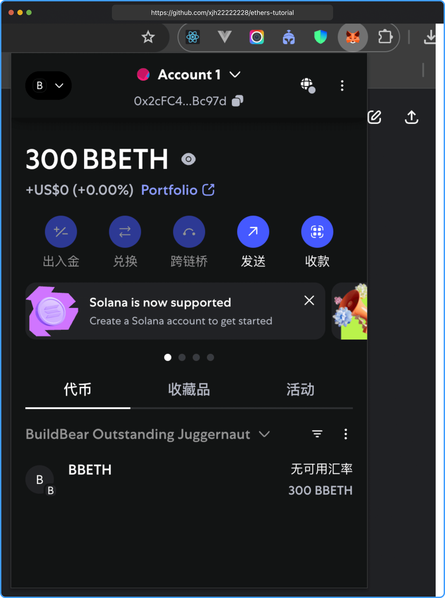
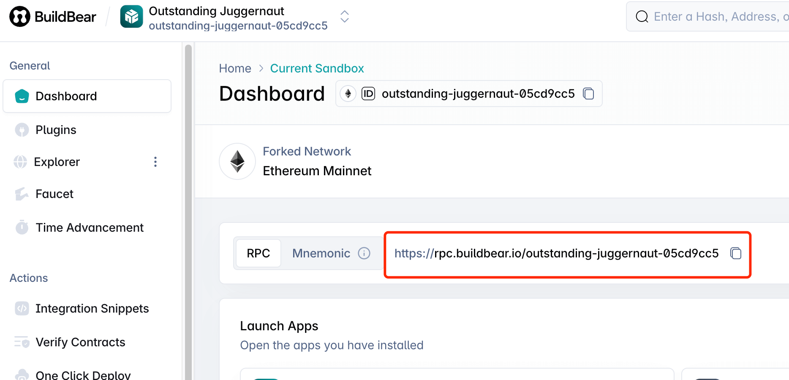
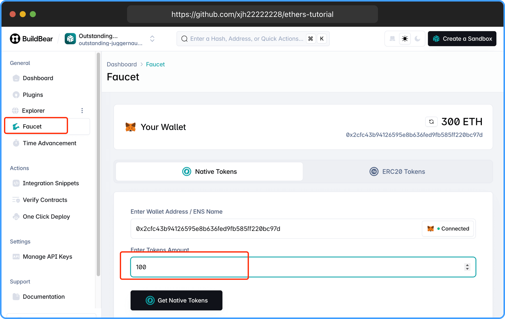

# 准备工作

把以下需要安装的提前准备好便于我们学习 `ethers.js` 。

## Node.js

[Node.js 下载地址](https://nodejs.org/zh-cn)

本教程所有示例代码使用 `node.js v22` 运行，确保您的版本 >= `22`，以便能正常顺利运行。

## VSCode

所有示例代码使用 [VSCode](https://code.visualstudio.com/) 开发，不强制要求你使用 `VSCode`，使用你熟悉的编辑器就可以。

## MetaMask

[MetaMask](https://chromewebstore.google.com/detail/metamask/nkbihfbeogaeaoehlefnkodbefgpgknn?utm_source=ext_app_menu) 钱包是一款浏览器插件，它可以让您在浏览器中访问以太坊网络，也是全球最流行的钱包。

后面教程我们需要用 `ethers.js` 来连接钱包和转账。



## Buildbear

`BuildBear` 是一个专注于 `Web3` 和去中心化应用（`DApp`）开发的测试平台，由 `BuildBear Labs` 开发。它为开发者提供了一个私有沙盒（Sandbox）环境，用于测试智能合约和 `DApp`，模拟真实区块链网络的条件。

选择 `BuildBear` 是因为它能提供无限水龙头便于我们学习开发， `infura` 等平台有一定的限额。

注册 [buildbear](https://auth.buildbear.io/)

获取 `RPC` 节点并拷贝，后续教程会用到。



点击 `Get Native Tokens` 获取 `ETH` 测试币。



你也可以使用 [infura](https://www.infura.io/zh) 或者其他提供测试平台，但最好以教程为主。

## infura

和 `Buildbear` 平台类似，提供了 `Sepolia` 测试网，部分章节需要用到 `Sepolia` 测试网。

前往注册 [infura](https://www.infura.io/zh) 并得到 `API Key`。

RPC: `https://sepolia.infura.io/v3/YOUR_API_KEY`

## 教程用到的相关信息

RPC 节点 `https://rpc.buildbear.io/outstanding-juggernaut-05cd9cc5` 如需调用转账请修改为您的 `RPC` 节点。

钱包地址 `0x2cfc43b94126595e8b636fed9fb585ff220bc97d` 如需转账 `ETH` 或者其他合约代币，可以转账到此地址进行学习。

`USDC` 合约地址： `0xA0b86991c6218b36c1d19D4a2e9Eb0cE3606eB48`

## 运行项目

```bash
$ git clone https://github.com/xjh22222228/ethers-tutorial.git
$ cd ethers-tutorial
$ pnpm i
$ npm run start
```

## 总结

本节我们介绍了学习 `ethers.js` 所需的基础准备，包括 `Node.js` 环境、开发工具 `VSCode`、测试网络 `BuildBear`、钱包插件 `MetaMask` 以及相关的 RPC 节点和合约信息。通过这些准备，你已经具备了后续学习和实践 `ethers.js` 的基础环境。接下来，我们将正式进入 `ethers.js` 的实战开发，体验 `Web3` 世界的魅力。
