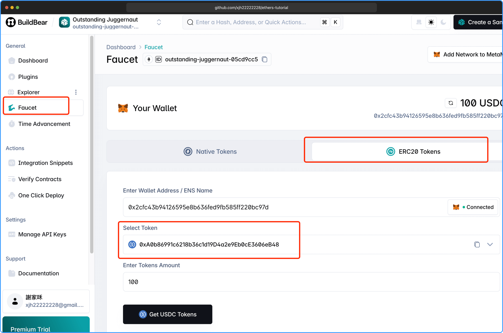

import Link from "@docusaurus/Link";

# 转账 ERC-20 代币

阅读本章之前请先阅读 <Link to="/docs/transaction/transactionEth">上一章</Link>，本章不会介绍各项配置如何获取。

本章将介绍如何转账 `ERC-20` `USDC` 代币。

### 什么是 ERC-20 代币

`ERC-20` 代币是一种在以太坊（Ethereum）区块链上开发和发行代币的技术标准。**ERC** 是 `“Ethereum Request for Comments”`（以太坊提案） 的缩写，`ERC-20` 是第 `20` 号提案，它定义了一组规则，使不同的代币可以在以太坊网络中以统一的方式被创建、发送和接收。

**简单来说：ERC-20 代币 = 建立在区块链平台上的数字资产**

---

如果需要转账 `ERC-20 `代币（如 `USDC`），需要调用代币合约的 `transfer` 方法：

### 创建钱包

```js
import { ethers } from "ethers";

// 配置 RPC 节点
const provider = new ethers.JsonRpcProvider(
  "https://rpc.buildbear.io/outstanding-juggernaut-05cd9cc5"
);

// 配置钱包
const privateKey = "..."; // 替换为你的私钥
const wallet = new ethers.Wallet(privateKey, provider);
```

### 编写 ABI 和声明合约

```js
// ERC-20 合约地址和 ABI
// USDC 合约地址，如果转账到 USDC 则不需要修改
const tokenAddress = "0xA0b86991c6218b36c1d19D4a2e9Eb0cE3606eB48"; // 替换为代币合约地址
// 声明ABI接口，用于调用代币合约的方法
const tokenABI = [
  "function symbol() view returns (string)",
  "function transfer(address to, uint256 value) public returns (bool)",
  "function decimals() view returns (uint8)",
];

// 创建代币合约实例
const tokenContract = new ethers.Contract(tokenAddress, tokenABI, wallet);
```

**合约代币地址获取方法：**

合约代币有很多种，这里选择 `USD Coin`，选择后会显示合约地址。



### 获取参数并发送转账

使用 ABI 接口 `transfer` 发起交易。

```js
// 转账参数
const recipientAddress = "0x817c6ef5f2ef3cc56ce87942bf7ed74138ec284c"; // 替换为接收者地址
const decimals = await tokenContract.decimals(); // 获取代币小数位数
const symbol = await tokenContract.symbol(); // 获取代币符号
const amount = ethers.parseUnits(String(values.amount), decimals); // 转账金额

// 发送代币转账交易
const tx = await tokenContract.transfer(recipientAddress, amount);
```

### 最后等待确认完成

```js
// 等待交易确认
const receipt = await tx.wait();
console.log(
  `交易已确认，区块号：${receipt.blockNumber}, Hash: ${receipt.hash}`
);
```

### 完整代码

```js
import { ethers } from "ethers";

// 配置 RPC 节点
const provider = new ethers.JsonRpcProvider(
  "https://rpc.buildbear.io/outstanding-juggernaut-05cd9cc5"
);

// 配置钱包
const privateKey = "..."; // 替换为你的私钥
const wallet = new ethers.Wallet(privateKey, provider);

// ERC-20 合约地址和 ABI
// USDC 合约地址，如果转账到 USDC 则不需要修改
const tokenAddress = "0xA0b86991c6218b36c1d19D4a2e9Eb0cE3606eB48"; // 替换为代币合约地址
// 声明ABI接口，用于调用代币合约的方法
const tokenABI = [
  "function symbol() view returns (string)",
  "function transfer(address to, uint256 value) public returns (bool)",
  "function decimals() view returns (uint8)",
];

// 创建代币合约实例
const tokenContract = new ethers.Contract(tokenAddress, tokenABI, wallet);

// 转账参数
const recipientAddress = "0x817c6ef5f2ef3cc56ce87942bf7ed74138ec284c"; // 替换为接收者地址
const decimals = await tokenContract.decimals(); // 获取代币小数位数
const symbol = await tokenContract.symbol(); // 获取代币符号
const amount = ethers.parseUnits(String(values.amount), decimals); // 转账金额

// 发送代币转账交易
const tx = await tokenContract.transfer(recipientAddress, amount);

// 等待交易确认
const receipt = await tx.wait();
console.log(
  `交易已确认，区块号：${receipt.blockNumber}, Hash: ${receipt.hash}`
);
```

import TransactionERC20 from "./TransactionERC20";

<TransactionERC20 />

## 总结

本章介绍了如何使用 `ethers.js` 实现 `ERC-20` 代币（如 `USDC`）的转账流程。主要步骤包括：

1. 配置 `RPC` 节点和钱包，确保能够与区块链交互；
2. 获取 `ERC-20` 合约地址和 ABI，创建合约实例；
3. 获取代币的小数位数（`decimals`）和符号（`symbol`），并根据用户输入的金额进行单位转换；
4. 调用合约的 `transfer` 方法发起转账交易；
5. 等待交易上链并确认，获取交易回执信息。

通过本章内容，你可以灵活地将任意 `ERC-20` 代币转账集成到自己的 `DApp` 或脚本中。建议在主网操作前，先在测试网充分测试，确保合约地址和参数正确无误。

本章所有示例代码，均可在 [GitHub](https://github.com/xjh22222228/ethers-tutorial/blob/main/docs/transaction/transactionERC20/TransactionERC20.tsx) 中找到。
