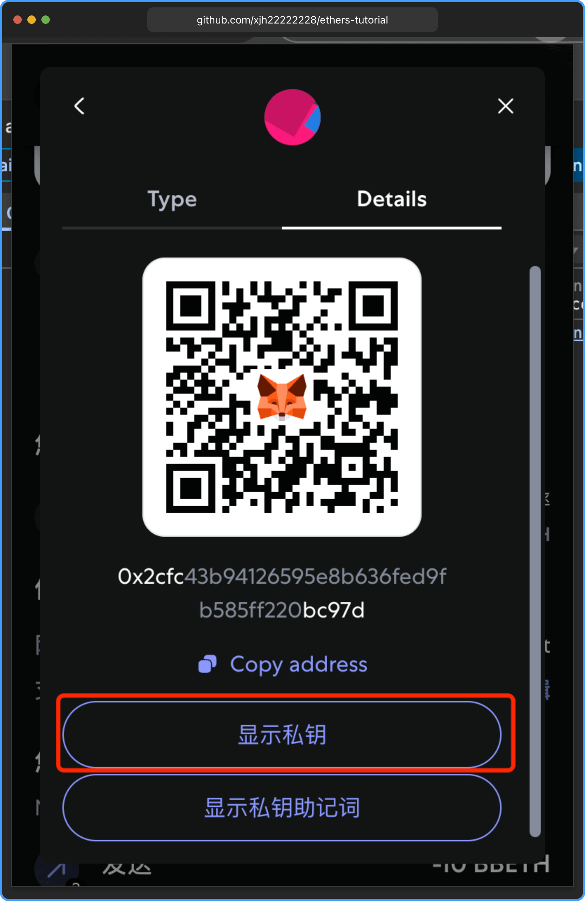

# 转账 ETH

本教程使用 [buildbear](https://faucet.buildbear.io/) 测试平台提供的配置信息进行测试，如果没有请先注册。

### 配置 RPC 远程调用和配置钱包

私钥获取方法：打开 `MetaMask` 钱包，点击右上角 `:` -> 账号详情 -> 详情



```js
import { ethers } from "ethers";
// 配置提供者（例如 buildbear、Infura、Alchemy 或本地节点）
const provider = new ethers.JsonRpcProvider(
  // 填写你的 RPC 节点，请不要使用下面
  "https://rpc.buildbear.io/outstanding-juggernaut-05cd9cc5"
);

// 配置钱包
const privateKey = "..."; // 替换为你的私钥
const wallet = new ethers.Wallet(privateKey, provider);
```

### 配置转账参数

转账接收者直接使用下面地址 `0x817c6ef5f2ef3cc56ce87942bf7ed74138ec284c` 不需要修改，交易结果可以在 [buildbear](https://explorer.buildbear.io/outstanding-juggernaut-05cd9cc5/address/0x817c6ef5f2ef3cc56ce87942bf7ed74138ec284c) 测试平台查看。

```js
import { ethers } from "ethers";
// 配置提供者（例如 buildbear、Infura、Alchemy 或本地节点）
const provider = new ethers.JsonRpcProvider(
  // 填写你的 RPC 节点，请不要使用下面
  "https://rpc.buildbear.io/outstanding-juggernaut-05cd9cc5"
);

// 配置钱包
const privateKey = "..."; // 替换为你的私钥
const wallet = new ethers.Wallet(privateKey, provider);

// 转账参数
const recipientAddress = "0x817c6ef5f2ef3cc56ce87942bf7ed74138ec284c"; // 替换为接收者地址
const amountInEther = "0.01"; // 转账金额（单位：ETH）
```

### 获取交易 nonce

使用 `provider.getTransactionCount` 方法获取当前钱包的 nonce，防止重复交易。

```js
import { ethers } from "ethers";
// 配置提供者（例如 buildbear、Infura、Alchemy 或本地节点）
const provider = new ethers.JsonRpcProvider(
  // 填写你的 RPC 节点，请不要使用下面
  "https://rpc.buildbear.io/outstanding-juggernaut-05cd9cc5"
);

// 配置钱包
const privateKey = "..."; // 替换为你的私钥
const wallet = new ethers.Wallet(privateKey, provider);

// 转账参数
const recipientAddress = "0x817c6ef5f2ef3cc56ce87942bf7ed74138ec284c"; // 替换为接收者地址
const amountInEther = "0.01"; // 转账金额（单位：ETH）

// 获取当前 nonce
const nonce = await provider.getTransactionCount(wallet.address, "pending");
```

### 获取 Gas 费用

使用 `provider.getFeeData` 方法获取当前网络的 `Gas` 费用。

```js
import { ethers } from "ethers";
// 配置提供者（例如 buildbear、Infura、Alchemy 或本地节点）
const provider = new ethers.JsonRpcProvider(
  // 填写你的 RPC 节点，请不要使用下面
  "https://rpc.buildbear.io/outstanding-juggernaut-05cd9cc5"
);

// 配置钱包
const privateKey = "..."; // 替换为你的私钥
const wallet = new ethers.Wallet(privateKey, provider);

// 转账参数
const recipientAddress = "0x817c6ef5f2ef3cc56ce87942bf7ed74138ec284c"; // 替换为接收者地址
const amountInEther = "0.01"; // 转账金额（单位：ETH）

// 获取当前 nonce
const nonce = await provider.getTransactionCount(wallet.address, "pending");

// 获取 Gas 费用
const feeData = await provider.getFeeData();
```

### 构建交易参数

这是最简单的交易参数，在生产中需要更多的参数。

```js
const tx = {
  // 转账给谁
  to: recipientAddress,
  // 转账数量，需要将 0.01 ETH转换为 wei 单位
  value: ethers.parseEther(amountInEther),
  // 交易 nonce
  nonce: nonce,
  // 标准转账 gas 限制, 设置一个 gas 费用上限，避免多扣
  gasLimit: 21000,
  // 设置 gas 价格
  gasPrice: feeData.gasPrice,
};
```

### 签名并发送交易

调用钱包 `sendTransaction` 方法发送交易，返回 `TransactionResponse` 对象。

```js
import { ethers } from "ethers";
// 配置提供者（例如 buildbear、Infura、Alchemy 或本地节点）
const provider = new ethers.JsonRpcProvider(
  // 填写你的 RPC 节点，请不要使用下面
  "https://rpc.buildbear.io/outstanding-juggernaut-05cd9cc5"
);

// 配置钱包
const privateKey = "..."; // 替换为你的私钥
const wallet = new ethers.Wallet(privateKey, provider);

// 转账参数
const recipientAddress = "0x817c6ef5f2ef3cc56ce87942bf7ed74138ec284c"; // 替换为接收者地址
const amountInEther = "0.01"; // 转账金额（单位：ETH）

// 获取当前 nonce
const nonce = await provider.getTransactionCount(wallet.address, "pending");

// 获取 Gas 费用
const feeData = await provider.getFeeData();

const tx = {
  // 转账给谁
  to: recipientAddress,
  // 转账数量，需要将 0.01 ETH转换为 wei 单位
  value: ethers.parseEther(amountInEther),
  // 交易 nonce
  nonce: nonce,
  // 标准转账 gas 限制, 设置一个 gas 费用上限，避免多扣
  gasLimit: 21000,
  // 设置 gas 价格
  gasPrice: feeData.gasPrice,
};

// 签名并发送交易
const transaction = await wallet.sendTransaction(tx);
```

### 最后等待交易确认

等待确认交易需要一定的时间，可以从 [https://explorer.buildbear.io/outstanding-juggernaut-05cd9cc5/address/0x817c6ef5f2ef3cc56ce87942bf7ed74138ec284c](https://explorer.buildbear.io/outstanding-juggernaut-05cd9cc5/address/0x817c6ef5f2ef3cc56ce87942bf7ed74138ec284c) 查看是否有交易记录。

以下是全部完整转账代码。

```js
import { ethers } from "ethers";
// 配置提供者（例如 buildbear、Infura、Alchemy 或本地节点）
const provider = new ethers.JsonRpcProvider(
  // 填写你的 RPC 节点，请不要使用下面
  "https://rpc.buildbear.io/outstanding-juggernaut-05cd9cc5"
);

// 配置钱包
const privateKey = "..."; // 替换为你的私钥
const wallet = new ethers.Wallet(privateKey, provider);

// 转账参数
const recipientAddress = "0x817c6ef5f2ef3cc56ce87942bf7ed74138ec284c"; // 替换为接收者地址
const amountInEther = "0.01"; // 转账金额（单位：ETH）

// 获取当前 nonce
const nonce = await provider.getTransactionCount(wallet.address, "pending");

// 获取 Gas 费用
const feeData = await provider.getFeeData();

const tx = {
  // 转账给谁
  to: recipientAddress,
  // 转账数量，需要将 0.01 ETH转换为 wei 单位
  value: ethers.parseEther(amountInEther),
  // 交易 nonce
  nonce: nonce,
  // 标准转账 gas 限制, 设置一个 gas 费用上限，避免多扣
  gasLimit: 21000,
  // 设置 gas 价格
  gasPrice: feeData.gasPrice,
};

// 签名并发送交易
const transaction = await wallet.sendTransaction(tx);

// 等待交易确认
const receipt = await transaction.wait();
console.log(`交易已确认，区块号：${receipt.blockNumber}`);
```

import TransactionEth from "./TransactionEth";

<TransactionEth />

## 总结

本教程详细介绍了如何使用 Ethers.js 在以太坊网络上完成 ETH 的标准转账流程，包括：

- 配置 RPC 提供者和钱包；
- 获取转账所需的 nonce 和 gas 费用；
- 构建标准的转账参数对象；
- 使用钱包签名并发送交易；
- 等待交易上链并获取交易回执。

通过这些步骤，你可以安全、规范地实现 ETH 的自动化转账操作。建议在实际生产环境中，进一步完善异常处理和安全措施，确保资金安全。

本章所有示例代码，均可在 [GitHub](https://github.com/xjh22222228/ethers-tutorial/blob/main/docs/transaction/transactionEth/TransactionEth.tsx) 中找到。
